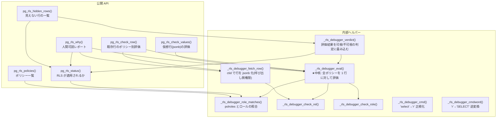
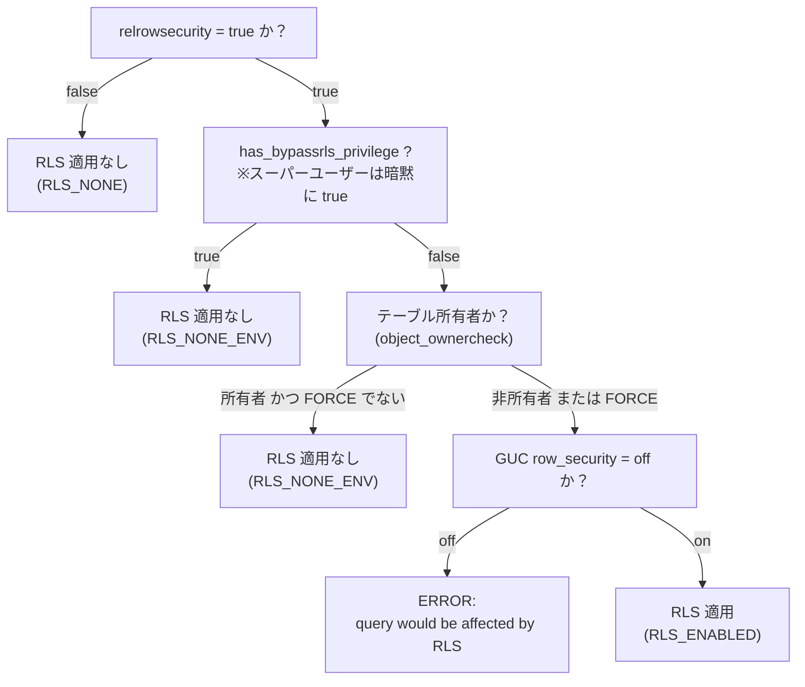
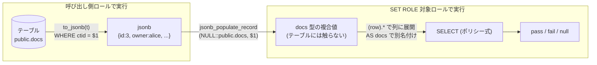
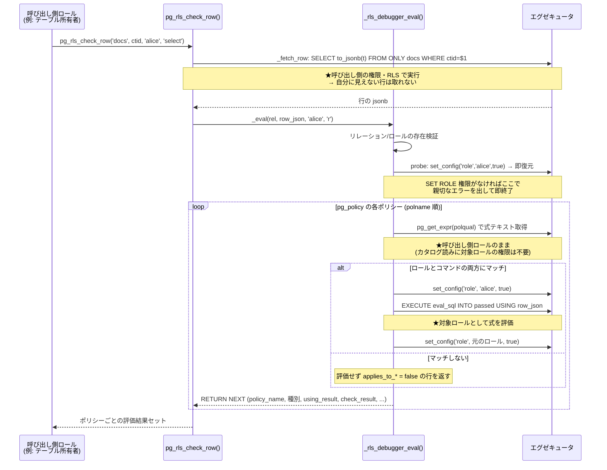
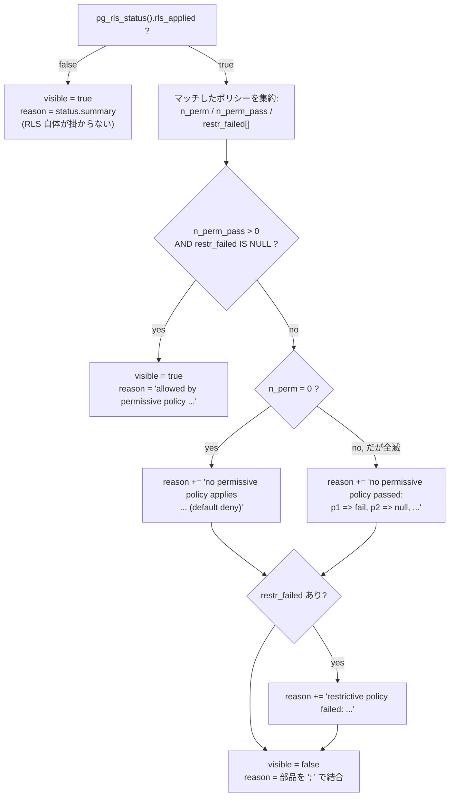
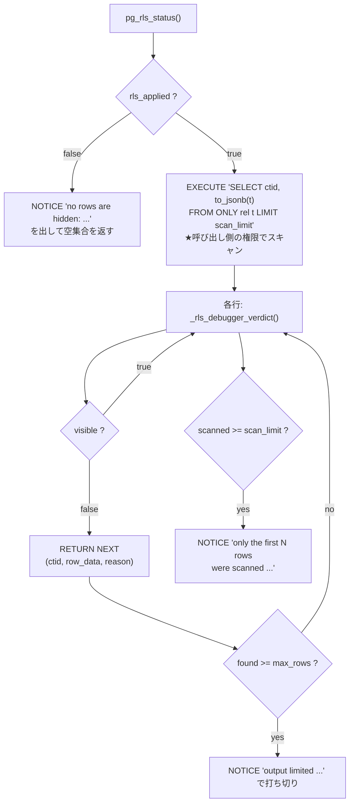
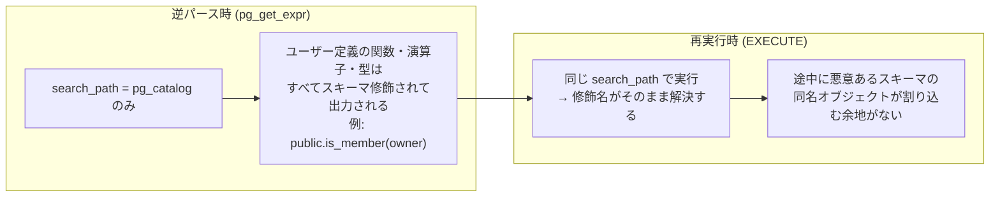
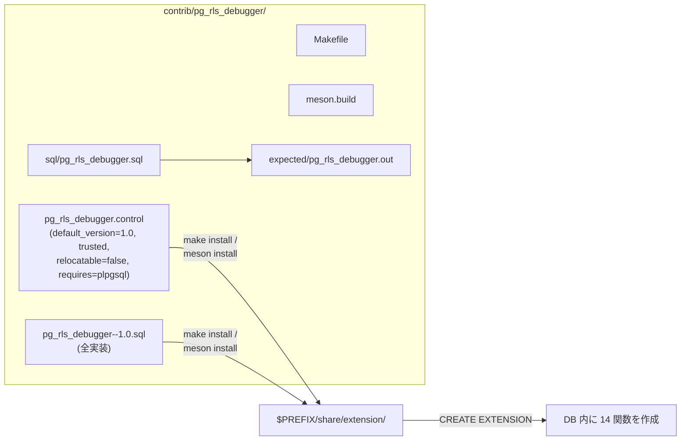

# pg_rls_debugger 内部実装ドキュメント

このドキュメントは、`pg_rls_debugger` の実装を後から読み解く人（将来の自分を含む）の
ためのものです。「なぜこう書いたのか」という設計判断と、plpgsql 実装上の落とし穴を
中心に説明します。利用者向けの説明は [README.ja.md](README.ja.md) を参照してください。

対象ソース: [`pg_rls_debugger--1.0.sql`](pg_rls_debugger--1.0.sql)（拡張の全実装。C コードはありません）

## 目次

1. [全体アーキテクチャ](#全体アーキテクチャ)
2. [前提知識: PostgreSQL の RLS 内部](#前提知識-postgresql-の-rls-内部)
3. [中核の仕組み: ポリシー式を「行の外」で再評価する](#中核の仕組み-ポリシー式を行の外で再評価する)
4. [関数リファレンス（実装視点）](#関数リファレンス実装視点)
5. [セキュリティ設計](#セキュリティ設計)
6. [plpgsql 実装上の落とし穴と対策](#plpgsql-実装上の落とし穴と対策)
7. [ビルドシステムへの統合](#ビルドシステムへの統合)
8. [リグレッションテストの設計](#リグレッションテストの設計)
9. [既知の制限と今後の拡張案](#既知の制限と今後の拡張案)

---

## 全体アーキテクチャ

拡張は「公開 API 6 関数 + 内部ヘルパー 8 関数」の 2 層構成です。
内部ヘルパーは `_rls_debugger_` プレフィックスで区別しています
（スキーマを分けていないのは、拡張のスキーマ移動を単純に保つためです。
[relocatable = false の理由](#extschema-と-relocatable--false) も参照）。



呼び出し関係のポイント:

- **`_rls_debugger_eval()` がすべての評価の中核**です。他の関数は「行をどう用意するか」
  「結果をどう見せるか」の違いでしかありません。
- `pg_rls_why()` は `_rls_debugger_verdict()` を使わず、自分のループ内で判定を
  畳み込みます。これは意図的です（[後述](#pg_rls_why-が-_verdict-を使わない理由)）。
- `pg_rls_hidden_rows()` は行ごとに `_rls_debugger_verdict()` を呼びます
  （＝行ごとに `_eval` が走る。デバッグ用途なので性能より単純さを優先）。

---

## 前提知識: PostgreSQL の RLS 内部

この拡張は「バックエンドが RLS をどう適用するか」を SQL レベルで忠実に再現します。
再現元は次の 3 箇所です。

| 再現対象 | バックエンドの実装 | 拡張側の対応物 |
|---|---|---|
| RLS がそもそも適用されるか | `check_enable_rls()`（`src/backend/utils/misc/rls.c`） | `pg_rls_status()` の `rls_applied` 計算 |
| ポリシーがロールに掛かるか | `check_role_for_policy()`（`src/backend/rewrite/rowsecurity.c`） | `_rls_debugger_role_matches()` |
| 複数ポリシーの合成 | `get_row_security_policies()` + エグゼキュータ | `_rls_debugger_verdict()` / `pg_rls_why()` の畳み込み |

### check_enable_rls() の判定順序

`rls.c` の実装を読むと、判定は次の順です（この**順序**が重要です。
たとえば BYPASSRLS 持ちの所有者には FORCE も効きません）:



`pg_rls_status()` の計算式はこれをそのまま写しています:

```sql
rls_applied := rls_enabled
               AND NOT role_is_superuser
               AND NOT role_has_bypassrls
               AND (rls_forced OR NOT role_is_owner);
```

- `role_is_superuser OR role_has_bypassrls` が `has_bypassrls_privilege()` に対応
  （スーパーユーザーは `rolbypassrls` が false でもバイパスする点に注意）。
- 所有者判定は `pg_has_role(target_role, relowner, 'USAGE')` を使います。
  バックエンドの `object_ownercheck()` も `has_privs_of_role()`（継承込みの所有権）
  なので、これと一致します。
- `row_security = off` のケースは「エラーになる」のであって「バイパスされる」の
  ではないため、`rls_applied` には含めず `summary` 内の WARNING として表現します。

### check_role_for_policy() とポリシーのロール照合

`pg_policy.polroles` は oid 配列で、`{0}` は PUBLIC（全ロール対象）を意味します。
バックエンドは各エントリに対して `has_privs_of_role(user_id, role)` を呼びます。
これは「**INHERIT で継承しているメンバーシップ**」であり、SQL 関数では
`pg_has_role(user, role, 'USAGE')` が同じ意味です（`'MEMBER'` は SET ROLE 可能か
という別の概念なので使いません）。実装:

```sql
RETURN (pol_roles = '{0}'::oid[]
        OR EXISTS (SELECT 1 FROM unnest(pol_roles) AS r(roleid)
                   WHERE pg_has_role(target_role, r.roleid, 'USAGE')));
```

補足: `pg_has_role(name, oid, text)` は存在しない oid に対して NULL を返すため、
DROP ROLE 後にダングリングした polroles エントリがあっても EXISTS が
エラーにならず false 側に倒れます。

### polcmd とコマンドの対応

`pg_policy.polcmd` は 1 文字（`"char"` 型）です:

| polcmd | 意味 | USING を評価するコマンド | WITH CHECK を評価するコマンド |
|---|---|---|---|
| `r` | FOR SELECT | SELECT | — |
| `a` | FOR INSERT | — | INSERT |
| `w` | FOR UPDATE | UPDATE（既存行の可視性） | UPDATE（新しい行値） |
| `d` | FOR DELETE | DELETE | — |
| `*` | FOR ALL | SELECT/UPDATE/DELETE | INSERT/UPDATE |

さらにバックエンドは「`WITH CHECK` が省略された ALL/UPDATE ポリシーでは
`USING` 式を WITH CHECK として使い回す」という仕様があります
（`rowsecurity.c` 内の `policy->with_check_qual = copyObject(policy->qual)`）。
拡張側は `check_expr := COALESCE(pol.p_check, pol.p_qual)` で再現しています。

### PERMISSIVE / RESTRICTIVE の合成規則

エグゼキュータは適用対象のポリシーを次のように合成します
（`NULL` は false と同じ扱い＝行は見えない）:

```
可視 ⟺ (PERMISSIVE のうち少なくとも 1 つが true)
      AND (RESTRICTIVE のすべてが true)
```

適用対象の PERMISSIVE ポリシーが 1 つもない場合はデフォルト拒否
（すべての行が不可視）になります。この「0 個なら拒否」は見落としやすいので、
`pg_rls_status()` の summary と `_rls_debugger_verdict()` の reason の両方で
明示的に文言を出しています。

---

## 中核の仕組み: ポリシー式を「行の外」で再評価する

### 問題設定

「この行に対してポリシー式が true になるか」を知りたい。しかし:

1. **対象の行はそのロールには見えない**（それを調べているのだから）。
   つまり「対象ロールでテーブルをスキャンして式を評価する」ことはできない。
2. ポリシー式には `current_user` やサブ SELECT が含まれ得るので、
   **評価は本物の対象ロールで**行わないと意味のある結果にならない。
3. ポリシー式はカタログ（`pg_policy.polqual`）にパース済みツリーとして
   格納されており、そのままでは実行できない。

### 解決: 行を jsonb で運び、行型に復元して、SET ROLE 下で実行する

`_rls_debugger_eval()` は各ポリシー式に対して次の SQL を組み立てて実行します:

```sql
SELECT (<ポリシー式>)
FROM (SELECT (jsonb_populate_record(NULL::<スキーマ修飾テーブル名>, $1)).*) AS <テーブル名>
```



それぞれの部品に理由があります:

- **`jsonb_populate_record(NULL::型, $1)`** — jsonb をテーブルの行型の複合値に
  復元します。`NULL::public.docs` は「docs テーブルの行型」を指すための定石です。
  実テーブルを一切参照しないので、対象ロールにテーブルの SELECT 権限がなくても、
  RLS で行が見えなくても評価できます。
- **`(...).*` で列に展開し `AS <テーブル名>` を付ける** — ポリシー式を
  `pg_get_expr()` で逆パースすると、列参照は `owner` のような非修飾か、
  曖昧さ回避が必要な場合に `docs.owner` のように**テーブル名で**修飾されます。
  FROM 句の別名を実テーブル名と同じにしておけば、どちらの形でも解決できます
  （`format()` の `%I` で必要に応じて引用符が付きます）。
- **行データは `EXECUTE ... USING row_data` のパラメータ `$1` で渡す** —
  文字列連結で埋め込まないので、行データに何が入っていても SQL
  インジェクションになりません（ポリシー式自体はカタログ由来で、
  テーブルに CREATE POLICY できる人＝所有者しか書けないものです）。
- **`SET ROLE` 下で実行** — `current_user` が対象ロールを返し、式の中の
  サブ SELECT が参照する他テーブルにも対象ロール自身の権限と RLS が掛かります。
  つまり「本物のクエリで RLS が評価されるときの環境」を再現しています。

なぜ record 型で直接渡さず jsonb を経由するのか:

- plpgsql の record 変数を `EXECUTE ... USING` で渡して `$1::docs` のように
  複合型へキャストする方法は、record→複合型の変換パスの制約で壊れやすい
  （パラメータ経由の record は `coerce_record_to_complex()` の対象になりません）。
- jsonb なら `pg_rls_check_values()`（仮想行の評価）と
  `pg_rls_hidden_rows()` の `row_data` 出力列が同じ仕組みで実現できます。
- 代償は json ラウンドトリップの非可逆性で、これは README の注意事項に
  記載しています（通常の型では問題になりません）。

### _rls_debugger_eval() のシーケンス

権限の境界（どのロールで何が実行されるか）が最重要ポイントです:



### SET ROLE の切り替えを「式の評価ごと」に行う理由

素朴には「ループ全体を SET ROLE で囲む」方が単純ですが、あえて
式 1 個の評価ごとに `set_config('role', ...)` → 評価 → 復元、としています:

1. **カタログ読み（ポリシー一覧の取得）を呼び出し側ロールで行うため。**
   ループのクエリは `@extschema@._rls_debugger_role_matches()` を呼びます。
   もし対象ロールに切り替えた状態でこれが走ると、対象ロールに拡張スキーマの
   USAGE 権限がない環境で不可解に失敗します。切り替え範囲を EXECUTE 1 文に
   絞ることで、対象ロールに要求する権限を最小化しています。
2. **エラー時の後始末が自動になるため。** 評価は
   `BEGIN ... EXCEPTION WHEN OTHERS` ブロック内で行います。plpgsql の
   EXCEPTION 付きブロックはサブトランザクションなので、式の評価が
   エラーになるとブロック内の変更が**GUC の変更も含めて**ロールバックされ、
   ロールが自動的に元に戻ります。ブロック内で明示的に復元しているのは
   正常系のためで、異常系はサブトランザクション巻き戻しに任せています。

```sql
BEGIN
    PERFORM set_config('role', target_role::text, true);
    EXECUTE eval_sql INTO passed USING row_data;
    PERFORM set_config('role', saved_role, true);   -- 正常系の復元
    using_result := CASE WHEN passed IS NULL THEN 'null'
                         WHEN passed THEN 'pass' ELSE 'fail' END;
EXCEPTION WHEN OTHERS THEN
    -- サブトランザクション巻き戻しでロールは復元済み
    using_result := 'error: ' || SQLERRM;
END;
```

なお、ループに入る前に一度だけ「probe」（SET ROLE を試して即復元）を行います。
これは SET ROLE 権限がない場合に、ポリシー数分の同じエラーを繰り返さず、
先頭で 1 回だけ DETAIL/HINT 付きの分かりやすいエラーを出すためです。

### 元のロールの保存と復元

`saved_role := current_setting('role')` は、SET ROLE していないセッションでは
文字列 `'none'` を返します。`set_config('role', 'none', true)` は「SET ROLE の
解除」として機能するので、保存値をそのまま書き戻すだけで両方のケースを
正しく扱えます。`set_config(..., is_local := true)` はトランザクション
ローカルなので、仮に復元漏れがあってもトランザクション終了で消えますが、
同一トランザクション内の後続文に影響しないよう必ず明示復元しています。

---

## 関数リファレンス（実装視点）

### 内部ヘルパー

| 関数 | 役割 | 実装メモ |
|---|---|---|
| `_rls_debugger_check_rel(regclass)` | relkind 検証 | `'r'`（通常テーブル）と `'p'`（パーティション親）のみ許可。RLS が定義できるのはこの 2 種だけ |
| `_rls_debugger_check_role(name)` | ロール存在検証 | `pg_roles` を引く。NULL も明示的に拒否 |
| `_rls_debugger_cmd(text)` | コマンド正規化 | `'select'`→`'r'` 等。不正値は HINT 付きエラー。IMMUTABLE |
| `_rls_debugger_cmdword(text)` | 逆変換 | `'r'`→`'SELECT'`。表示用。新形式 SQL 関数（`RETURN CASE ...`） |
| `_rls_debugger_role_matches(oid[], name)` | polroles 照合 | 上述。STABLE |
| `_rls_debugger_fetch_row(regclass, tid)` | 行の jsonb 化 | `FROM ONLY` + `WHERE ctid = $1`。見つからない場合のエラーに「RLS で隠されている可能性」の HINT を含める |
| `_rls_debugger_eval(...)` | 中核評価器 | 上述 |
| `_rls_debugger_verdict(...)` | 判定の畳み込み | 下述 |

### _rls_debugger_verdict() の畳み込みロジック

`_eval` の結果（ロールとコマンドの両方にマッチしたものだけ）を 1 つの
集約クエリで畳み込みます。コマンドによって「どちらの結果が効くか」が違う点に
注意してください:

```sql
relevant := CASE WHEN cmdc = 'a' THEN check_result  -- INSERT は WITH CHECK
                 ELSE using_result END              -- SELECT/UPDATE/DELETE は USING
```



細かい仕様:

- **`relevant` が NULL の RESTRICTIVE ポリシーは「失敗」に数えない。**
  該当する句を持たないポリシー（例: SELECT を評価しているときに
  WITH CHECK しか持たないポリシーはそもそもマッチしませんが、
  理論上 USING を持たないケース）は何も主張しない＝無視、が
  バックエンドの挙動です。フィルタ条件
  `relevant IS NOT NULL AND relevant <> 'pass'` はこれを表現しています。
- `'null'`（式が NULL を返した）と `'error: ...'` はどちらも
  「pass ではない」ので不可視側に倒れます。実際のクエリでは式のエラーは
  クエリ全体のエラーになるため厳密には挙動が違いますが、デバッガーとしては
  「このポリシーが原因」と示す方が有用と判断しました。

### 公開 API

#### pg_rls_status(rel, target_role)

単一行を返す `RETURNS TABLE`。`rls_applied` の計算は
[check_enable_rls() の再現](#check_enable_rls-の判定順序)そのものです。
`summary` は分岐ごとに文言を組み立てており、特に

- RLS 無効なのにポリシーが存在する場合の
  「`did you forget ALTER TABLE ... ENABLE ROW LEVEL SECURITY?`」
- 適用対象ポリシーが 0 件の場合の「`default deny, ALL rows are hidden`」

という 2 つの「あるある」を必ず文面に出すようにしています。

#### pg_rls_policies(rel, target_role)

`pg_policy` の薄いビューに `_role_matches` の結果を足したものです。
`polroles = '{0}'` の場合は表示用に `ARRAY['public'::name]` へ変換します。
`RETURN QUERY` の SELECT は出力列と同名の識別子を参照しないよう
書いています（[変数名の衝突](#出力変数とカタログ列名の衝突)参照）。

#### pg_rls_check_row(rel, ctid, target_role, command) / pg_rls_check_values(rel, jsonb, ...)

どちらも `_fetch_row`（または引数の jsonb をそのまま）＋ `_eval` への
委譲です。**2 つを別名の関数にしているのは意図的**です: 1 つの
`pg_rls_check(regclass, ...)` に tid 版と jsonb 版のオーバーロードを
用意すると、`pg_rls_check('docs', '(0,1)')` のような呼び出しで
`'(0,1)'`（unknown 型リテラル）が tid にも jsonb にも解釈でき、
関数解決が曖昧エラーになるためです。

`pg_rls_check_values` は `jsonb_typeof(row_data) <> 'object'` を先に検査し、
配列などを渡した場合に分かりやすいエラーを出します。デフォルトコマンドは
`'INSERT'`（仮想行のユースケースは INSERT 前チェックが大半のため）。

#### pg_rls_why(rel, ctid, target_role, command)

`text` を 1 つ返すレポート生成器です。行の構築は `lines text[]` に
積んで最後に `array_to_string(lines, E'\n')` で結合します。

##### pg_rls_why が _verdict を使わない理由

`_verdict` は内部で `_eval` を呼ぶため、`pg_rls_why` が「表示用に `_eval`、
判定用に `_verdict`」と 2 回呼ぶと**ポリシー式が 2 回評価**されます。
volatile な式（`random()` や時刻依存の条件など）では表示と判定が
食い違う可能性があるため、`pg_rls_why` はループ内で表示行を組み立て
**ながら**、同じ評価結果から判定用のカウンタ
（`n_perm` / `n_perm_pass` / `restr_failed[]` / `check_trouble[]`）を
畳み込みます。約 15 行のロジック重複は、この一貫性のための意図的な
トレードオフです。

UPDATE の場合だけ `check_trouble` という追加の畳み込みがあります。
デバッガーは「更新後の行」を持っていないので、WITH CHECK を
**現在の行の値**に対して評価します。これが fail した場合は
「値を変えない UPDATE でも WITH CHECK に弾かれる」ことを意味するので、
VERDICT の後に Note 行として警告します。

#### pg_rls_hidden_rows(rel, target_role, command, max_rows, scan_limit)



2 つの上限は役割が違います:

- `scan_limit`（デフォルト 10000）: **入力側**の上限。巨大テーブルで
  行×ポリシー分の動的 SQL 評価が走るのを防ぐ安全弁。
- `max_rows`（デフォルト 100）: **出力側**の上限。隠れた行が大量に
  ある場合の出力洪水を防ぐ。

どちらの打ち切りも**必ず NOTICE を出す**ことにしています。
「静かに切り詰めて全件調べたように見える」のはデバッガーとして最悪の
挙動だからです。

---

## セキュリティ設計

この拡張は「デバッガー」という性質上、設計を誤ると RLS の迂回路に
なりかねません。守っている不変条件は次の 2 つだけで、どちらも
PostgreSQL 自体の権限機構に強制させています（拡張側の独自チェックに
依存しない）:

1. **呼び出し側が既に見られる行しか入力にならない。**
   行の取得（`_fetch_row` のスキャン、`pg_rls_hidden_rows` のスキャン）は
   すべて SECURITY INVOKER の関数内の動的 SQL＝呼び出し側の権限と RLS で
   実行されます。`SECURITY DEFINER` はどこにも使っていません。
2. **対象ロールとしての評価には SET ROLE 権限が必要。**
   `set_config('role', ...)` は SET ROLE と同じ権限検査
   （対象ロールのメンバーであること）を通ります。

この 2 つが成り立つ限り、「所有者や BYPASSRLS 持ちが自分の見える行について、
自分が成り代われるロールの視点を調べる」以上のことはできません。

### search_path 固定と式の再実行安全性

全関数に `SET search_path = pg_catalog, pg_temp` を付けています。
これは 2 つの効果を同時に狙ったものです:



- `pg_get_expr()` の出力は**実行時の search_path に依存**します。
  search_path に入っていないスキーマのオブジェクトは修飾されて出力される
  ため、path を `pg_catalog` だけに絞れば「常に完全修飾された式テキスト」が
  得られます。これを同じ path 下で EXECUTE するので、逆パース時と再実行時で
  名前解決が食い違うことがありません。
- 拡張自身の SQL が参照する `format()` / `to_jsonb()` などが、呼び出し側の
  search_path 上の同名オブジェクトに捕獲されるのを防ぎます。
- `pg_temp` を明示的に**末尾**へ置いているのは、省略すると pg_temp が
  暗黙に**先頭**へ挿入されるという search_path の仕様への対策です。

副次効果として、`format('... FROM ONLY %s ...', rel)` の `%s`
（regclass の出力）も「pg_catalog 以外のテーブルは常にスキーマ修飾される」
ことが保証されます。

### @extschema@ と relocatable = false

search_path を `pg_catalog` に固定した結果、**拡張自身の関数が search_path
上に存在しなくなる**ため、内部の相互呼び出しはすべて
`@extschema@._rls_debugger_xxx(...)` と書く必要があります。
`@extschema@` はスクリプト実行時（CREATE EXTENSION 時）にインストール先
スキーマ名へ文字列置換されるプレースホルダで、これを使うには
control ファイルで `relocatable = false` にする必要があります
（`ALTER EXTENSION ... SET SCHEMA` で後からスキーマを動かせなくなりますが、
インストール時の `CREATE EXTENSION ... SCHEMA xxx` は使えます）。

### trusted = true にできる理由

control ファイルの `trusted = true` により、スーパーユーザーでなくても
データベース所有者が `CREATE EXTENSION` できます。これが安全なのは:

- 実装が plpgsql のみ（C 関数・ファイルアクセス・untrusted 言語なし）
- 全関数が SECURITY INVOKER で、上記の不変条件により権限昇格経路がない

ためです。逆に言うと、**将来 SECURITY DEFINER の関数を足す変更は
この前提を壊す**ので、行う場合は trusted の妥当性を再検討してください。

---

## plpgsql 実装上の落とし穴と対策

実装中に実際に踏んだ・回避した罠のメモです。

### text[] への '' の追加は型注釈が必須

```sql
lines := lines || '';        -- NG! 実行時エラー
lines := lines || ''::text;  -- OK
```

`text[] || unknown` は演算子解決で `anyarray || anyarray` に倒れることがあり、
`''` を**配列リテラル**として解釈しようとして
`malformed array literal: ""` で落ちます。`format()` の戻り値のような
既知の text 型なら問題ありませんが、裸のリテラルには必ずキャストを付けます。

### 出力変数とカタログ列名の衝突

`RETURNS TABLE(policy_name name, ...)` の出力列は plpgsql では変数です。
関数内のクエリに同名の識別子が現れると
`column reference "..." is ambiguous` になります。対策として
`_rls_debugger_eval` のループクエリでは列に `p_name`, `p_qual` のような
出力変数と被らない別名を付けています。同じ理由で `pg_rls_status` の
ローカル変数は `rel_owner`（`pg_class.relowner` と衝突しない名前）です。

### EXECUTE 内では変数置換されない

plpgsql の変数置換は静的 SQL にしか働きません。動的 SQL
（`EXECUTE format(...)`）へ値を渡すのは必ず `USING` パラメータか
`format()` の `%I`/`%s`/`%L` で行います。この拡張では:

- 識別子 → `%I`（`rel_alias`）または regclass の `%s` 出力（既に引用済み）
- 行データ → `USING`（`$1`）
- ポリシー式 → `%s`（信頼できるカタログ由来テキストなのでそのまま埋め込み）

### set_config(..., is_local = true) のスコープ

`true`（トランザクションローカル）は「関数を抜けたら戻る」**ではなく**
「トランザクションが終わったら戻る」です。複数文トランザクションの中で
呼ばれても影響が漏れないよう、正常系では必ず明示的に復元し、
異常系はサブトランザクション巻き戻しに任せる、という二段構えにしています
（関数の `SET search_path = ...` 節が関数スコープで自動復元されるのとは
仕組みが違う点に注意）。

### CASE 文の網羅と "char" 型の比較

`pg_policy.polcmd` は `"char"`（1 バイト）型です。plpgsql での比較を
単純にするため、ループクエリで `p.polcmd::text` に変換してから扱います。
`kind NOT IN ('r', 'p')` のような `"char"` と unknown リテラルの比較は
そのままで安全です。

---

## ビルドシステムへの統合

PostgreSQL contrib は autoconf(make) と meson の**両方**に登録が必要です:

| ファイル | 変更内容 |
|---|---|
| `contrib/Makefile` | `SUBDIRS` に `pg_rls_debugger` を追加（アルファベット順） |
| `contrib/meson.build` | `subdir('pg_rls_debugger')` を追加（同上） |
| `contrib/pg_rls_debugger/Makefile` | `EXTENSION`/`DATA`/`REGRESS` のみの SQL-only 構成。`USE_PGXS=1` での単独ビルドにも対応する標準の二分岐 |
| `contrib/pg_rls_debugger/meson.build` | C コードがないため `install_data`（control と SQL）と `tests`（regress）のみ。`shared_module` は無い |

meson 側の `tests += {...}` 辞書は `src/test/modules/unsafe_tests`
（SQL-only テストの前例）の形式に合わせています。



バージョンアップ時は `pg_rls_debugger--1.0--1.1.sql`（差分スクリプト）を
追加し、control の `default_version` を上げ、`DATA` と `install_data` に
新ファイルを足します（contrib の慣例どおり）。

## リグレッションテストの設計

`sql/pg_rls_debugger.sql` → `expected/pg_rls_debugger.out` の
pg_regress 標準方式です。設計上の配慮:

- **ロール名は `regress_` プレフィックス必須**（in-tree テストの規約。
  installcheck で実クラスタに一時ロールを作るため、衝突しにくい名前空間に
  限定されています）。テスト末尾で必ず DROP します。
- **ctid の決定性**: 新規テーブルへの順次 INSERT なら `(0,1)` から始まる
  ctid は安定しますが、テストでは可能な限り
  `FROM docs d, LATERAL pg_rls_check_row('docs', d.ctid, ...) WHERE d.id = 3`
  の形で **id から ctid を引く**書き方にし、物理位置への依存を避けています。
- **出力の決定性**: `_eval` が `ORDER BY polname` で返すこと、jsonb の
  キー順序が正規化されていること、エラーメッセージ（`SQLERRM` を含む
  `error: ...`）が安定していることに依存しています。ロケール依存の出力は
  ありません。
- カバレッジ: PERMISSIVE/RESTRICTIVE 合成、ロール不一致・コマンド不一致の
  スキップ表示、BYPASSRLS/所有者/FORCE の status 判定、デフォルト拒否、
  WITH CHECK の USING フォールバック、仮想行の INSERT チェック、
  max_rows/scan_limit の NOTICE、**非特権ユーザーとしての実行**
  （`SET SESSION AUTHORIZATION` で自分をデバッグできる/他人になれない）、
  評価時エラーの捕捉、ビュー・存在しないロール・不正コマンドのエラー系。

期待出力を更新するときは `make check` を走らせ、
`results/pg_rls_debugger.out` を目視確認してから
`expected/pg_rls_debugger.out` にコピーしてください。

## 既知の制限と今後の拡張案

現状の制限（README の Caveats と対応）:

1. **UPDATE/DELETE への SELECT ポリシー合成を模倣していない。**
   実際のプランナは、既存列値を読む UPDATE/DELETE（WHERE 句がある等）に
   SELECT コマンドのポリシー条件も合成します（`get_row_security_policies()`
   が RTE の requiredPerms を見て判断）。デバッガーは指定コマンドの
   ポリシーだけを評価します。実装するなら `applies_to_cmd` の判定に
   「UPDATE/DELETE 時は 'r' も含める」オプションを足すのが素直です。
2. **`ON CONFLICT DO UPDATE` / `MERGE` の特殊な評価順序は対象外。**
3. **json ラウンドトリップの非可逆性**（前述）。
4. **`pg_rls_why` の出力は英語のみ。** 多言語化するなら文言を
   まとめたヘルパーに切り出す必要があります。

拡張のアイデア:

- `pg_rls_diff(rel, role1, role2)`: 2 ロール間で可視性が異なる行の一覧
- `EXPLAIN` 風の出力形式（json フォーマットの `pg_rls_why`）
- 行を要求しない静的検査（「このポリシーはどのロールにもマッチしない」等の lint）
