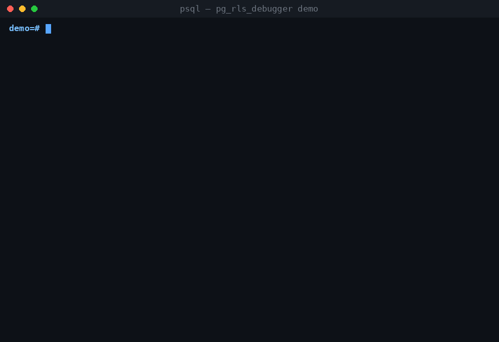

# pg_rls_debugger — X-ray vision for Row-Level Security

**Why can't this user see this row?**

Row-Level Security is one of PostgreSQL's most powerful features — and one of
its most frustrating to debug. When a policy doesn't do what you expect,
nothing errors: rows just silently vanish. Was it the policy expression? The
role list? A restrictive policy? Is RLS even being applied to that role, or is
it being bypassed because they own the table? You end up bisecting policies by
hand with `SET ROLE` and a scratch session.



`pg_rls_debugger` answers the question directly:

```sql
SELECT pg_rls_why('docs', '(0,3)', 'alice', 'select');
```

```
 RLS debug report for table public.docs
   row (0,3), role alice, command SELECT
   status: RLS is applied to role alice on public.docs: 4 of 5 policies match the role

   PERMISSIVE policy p_admin_all (FOR ALL): skipped, role does not match
   PERMISSIVE policy p_insert_self (FOR INSERT): skipped, command does not match
   PERMISSIVE policy p_owner (FOR ALL):
     USING ((owner = CURRENT_USER)) => pass
   PERMISSIVE policy p_public_read (FOR SELECT):
     USING (is_public) => fail
   RESTRICTIVE policy r_tenant (FOR ALL):
     USING ((tenant = 1)) => fail

 VERDICT: role alice CANNOT SELECT this row.
 Reason: restrictive policy failed: r_tenant
```

Every policy, every clause, evaluated against the actual row, **as the target
role**, with a per-policy pass/fail and a final verdict that combines them
exactly the way the executor does.

## Functions

| Function | What it answers |
|---|---|
| `pg_rls_status(rel, role)` | Is RLS applied to this role here at all — or bypassed (superuser, BYPASSRLS, table owner, RLS not enabled)? |
| `pg_rls_policies(rel, role)` | Which policies exist, and which of them cover this role? |
| `pg_rls_check_row(rel, ctid, role, cmd)` | Per-policy USING / WITH CHECK results for one existing row. |
| `pg_rls_check_values(rel, jsonb, role, cmd)` | Same, for a hypothetical row — test an INSERT's WITH CHECK **before** running it. |
| `pg_rls_why(rel, ctid, role, cmd)` | The human-readable report above. |
| `pg_rls_hidden_rows(rel, role, cmd, max_rows, scan_limit)` | Scan the table and list the rows this role can NOT see, each with the reason. |

`role` defaults to `current_user`, `cmd` to `SELECT` (`INSERT` for
`pg_rls_check_values`).

## Quick tour

```sql
CREATE EXTENSION pg_rls_debugger;

-- 1. Sanity first: is RLS even in effect for this role?
SELECT rls_applied, summary FROM pg_rls_status('docs', 'alice');
--  f | RLS is enabled on public.docs but role alice owns the table
--      and FORCE ROW LEVEL SECURITY is not set

-- 2. Which rows would alice lose, and why?
SELECT row_data->>'id' AS id, reason
  FROM pg_rls_hidden_rows('docs', 'alice');
--  3 | no permissive policy passed: p_owner => fail, p_public_read => fail

-- 3. Will this INSERT be rejected? Find out without inserting:
SELECT policy_name, check_result
  FROM pg_rls_check_values('docs',
       '{"id": 99, "owner": "alice", "tenant": 2}', 'alice')
 WHERE applies_to_role AND applies_to_cmd;
--  p_insert_self | pass
--  r_tenant      | fail
```

A common workflow when a bug report says *"user X sees no data"*:

1. `pg_rls_status` — is RLS applied at all? (Half of all RLS bugs end here:
   the role has BYPASSRLS, owns the table, or RLS was never enabled — the
   summary calls out inactive policies and default-deny explicitly.)
2. `pg_rls_policies` — does any policy actually cover that role and command?
3. `pg_rls_why` on a row they should see — read the verdict.

## Installation

As part of the PostgreSQL source tree (this repository):

```sh
cd contrib/pg_rls_debugger
make && make install     # or: meson compile && meson install from the build dir
make check               # regression tests
```

Standalone against any existing installation, via PGXS:

```sh
cd contrib/pg_rls_debugger
make USE_PGXS=1 install
```

Then in your database:

```sql
CREATE EXTENSION pg_rls_debugger;
```

The extension is SQL-only (plpgsql) — no C code to compile, so it works
anywhere `CREATE EXTENSION` does, and it is marked *trusted*, so database
owners can install it without superuser.

## How it works

For each policy of the table, the debugger takes the policy expression as
deparsed by `pg_get_expr()` (with `search_path` pinned to `pg_catalog`, so all
references come out schema-qualified), rebuilds the row as a composite of the
table's row type with `jsonb_populate_record()`, and executes

```sql
SELECT (<policy expression>) FROM (SELECT (<row>).*) AS <table name>;
```

under `SET ROLE <target role>`. Because a real query runs as the real role:

- `current_user`, `current_setting()`, and friends return what they would
  return for the target role;
- sub-`SELECT`s inside policies hit other tables with the target role's own
  privileges and RLS, exactly as during a real scan;
- expressions that error (a missing custom GUC, say) are caught and reported
  per-policy as `error: ...` instead of aborting the whole report.

The applicability rules mirror the backend:
`check_enable_rls()` for whether RLS applies at all (superusers implicitly
have BYPASSRLS; owners are exempt unless `FORCE ROW LEVEL SECURITY`),
`check_role_for_policy()` for role matching (`pg_has_role(..., 'USAGE')`,
i.e. inherited membership), and the executor's combination rule for the
verdict: **at least one permissive policy must pass and every restrictive
policy must pass**, with `NULL` counting as failure. An `ALL`/`UPDATE` policy
without `WITH CHECK` falls back to its `USING` expression, like the real
thing.

## Security model

There is no `SECURITY DEFINER` and no privilege escalation anywhere:

- **Rows are fetched with the caller's own privileges and the caller's own
  RLS.** You can never inspect a row through this extension that you could
  not already `SELECT`. (That's why you typically run it as the table owner
  or a `BYPASSRLS` role — otherwise `pg_rls_hidden_rows` has nothing extra to
  look at.)
- **Debugging as another role requires `SET ROLE` permission on that role**,
  enforced by PostgreSQL itself. The previous role is always restored, even
  when a policy expression throws.
- Policy definitions are read from `pg_policy`, which is world-readable
  anyway.

## Caveats

- The debugger evaluates policies of the table you name. It does not model
  the extra `SELECT`-policy quals the planner adds to `UPDATE`/`DELETE`
  statements that read existing column values, nor `ON CONFLICT` special
  cases.
- Rows travel through `to_jsonb()` / `jsonb_populate_record()`; for exotic
  types whose json round-trip is lossy, results can differ from a native
  scan. Volatile policy expressions are re-evaluated per call.
- `pg_rls_hidden_rows` runs every applicable policy against every scanned row
  and is meant for debugging, not for production monitoring — bound it with
  `scan_limit` (default 10000) on big tables.
- For partitioned tables, policies apply to the table actually named in the
  query; run the debugger against the same table your query uses.

## Internals

A detailed developer-oriented walkthrough of the implementation —
architecture and evaluation-flow diagrams, the security design, and the
plpgsql pitfalls encountered — is available (in Japanese) in
[INTERNALS.ja.md](INTERNALS.ja.md).

## Testing

`make check` (or `meson test` with the `pg_rls_debugger` suite) runs a full
regression test covering permissive/restrictive combination, role matching,
FORCE/owner/BYPASSRLS status, default deny, WITH CHECK fallback, error
capture, and the unprivileged-caller path.

## License

PostgreSQL License, same as PostgreSQL itself.
