# CSNスナップショット実装解説

サブトランザクション64個制限（suboverflow → pg_subtrans SLRU 崩壊）の根本解決として
実装した、CSN（Commit Sequence Number）ベーススナップショットの**実装**解説である。
「なぜこの設計か」は設計書（`subtransaction-limit-redesign.md`）を参照。本書は
「コードがどう動くか」を、後からコードを読む人向けに説明する。

- 対象ブランチ: `claude/subtransaction-limit-design-ou7zk6`（PostgreSQL 20devel ベース）
- 主な新規ファイル: `src/backend/access/transam/csnlog.c`, `src/include/access/csnlog.h`

## 目次

1. [全体像 — 何がどう変わったか](#1-全体像--何がどう変わったか)
2. [コミット構成とファイルマップ](#2-コミット構成とファイルマップ)
3. [データ構造](#3-データ構造)
4. [可視性判定パス](#4-可視性判定パス)
5. [コミットプロトコル（CSNの採番と公開）](#5-コミットプロトコルcsnの採番と公開)
6. [なぜ「CSN＝コミットレコードLSN」ではダメだったか](#6-なぜcsnコミットレコードlsnではダメだったか)
7. [リカバリとホットスタンバイ](#7-リカバリとホットスタンバイ)
8. [pg_csnlogのライフサイクル](#8-pg_csnlogのライフサイクル)
9. [ロックフリー読み（SLRU seqlock）](#9-ロックフリー読みslru-seqlock)
10. [shadow検証（assertビルドの新旧照合）](#10-shadow検証assertビルドの新旧照合)
11. [残された機構とその役割変化](#11-残された機構とその役割変化)
12. [動作確認・再現手順](#12-動作確認再現手順)

---

## 1. 全体像 — 何がどう変わったか

### 1.1 旧アーキテクチャ（xip列挙スナップショット）

従来のスナップショットは「スナップショット取得時点で実行中だったXIDの列挙
（`xip[]`/`subxip[]`）」である。subxidの列挙は各バックエンドの固定64個キャッシュ
（`PGPROC_MAX_CACHED_SUBXIDS`）に依存し、1バックエンドでも溢れると
スナップショット全体が `suboverflowed` になり、可視性判定のたびに
pg_subtrans で subxid→topxid 変換が必要になっていた。

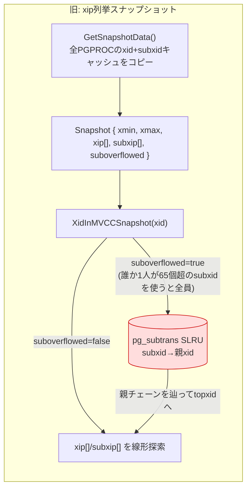

### 1.2 新アーキテクチャ（CSNスナップショット）

スナップショットは実質「単一のCSN値」になった。XIDの可視性は
「そのXIDのトランザクションツリーのCSNが、スナップショットのCSN以下か」の
1点比較である。**サブトランザクションは親とまったく同じCSNを持つ**ため、
subxid→topxid変換という操作自体が消滅し、pg_subtransは可視性ホットパスから
完全に外れた。「64個」という閾値はスナップショットにとって無意味になった。

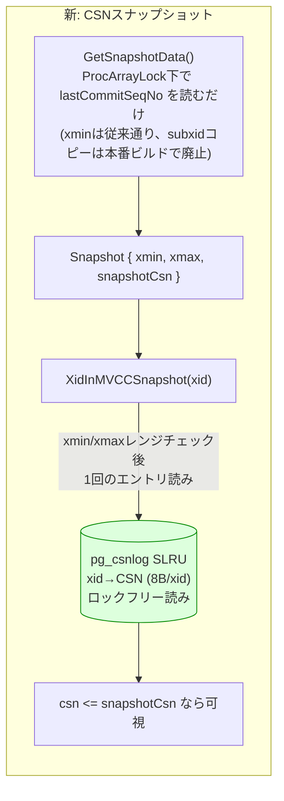

### 1.3 効果（実測、詳細は設計書§8.3）

| 状況 | 旧 | 新 |
|---|---|---|
| suboverflow中の2M行スキャン | 610〜634 ms | 322〜333 ms（1.9倍） |
| 同・pg_subtransアクセス/スキャン | 約700万回 | **0回** |
| 4並列読者・20秒の完了スキャン数 | 32 | 60（1.88倍） |
| 非オーバーフロー時の各種スキャン/tpcb | — | 差なし（回帰なし） |

---

## 2. コミット構成とファイルマップ

段階的に検証可能なよう、以下のコミット列で実装されている。各コミットは
独立にビルド・テスト可能。

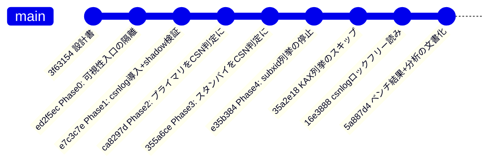

主な変更ファイルと役割:

| ファイル | 役割 |
|---|---|
| `access/transam/csnlog.c` **(新規)** | pg_csnlog SLRU本体。エントリ読み書き・staging・起動/チェックポイント/切り詰め |
| `include/access/csnlog.h` **(新規)** | 同公開API |
| `include/access/transam.h` | `CommitSeqNo`型・センチネル定義、`TransamVariables.lastCommitSeqNo` |
| `include/utils/snapshot.h` | `SnapshotData.snapshotCsn` |
| `include/storage/proc.h` | `PGPROC.commitCSN`（CSN受け渡し用）、subxidキャッシュのコメント更新 |
| `access/transam/xact.c` | コミット/アボート/redoでのスタンプとstaging |
| `access/transam/twophase.c` | 2PCのCOMMIT/ABORT PREPAREDでの採番・スタンプ |
| `access/transam/varsup.c` | `GetNewTransactionId()`での`ExtendCSNLOG()` |
| `access/transam/xlog.c` | BootStrap/Startup/CheckPoint/Truncateのフック、`lastCommitSeqNo`のシード |
| `access/transam/slru.c` | スロット変更カウンタ（seqlock）と`SimpleLruTryReadUInt64()` |
| `storage/ipc/procarray.c` | **CSN採番点**（`ProcArrayEndTransactionInternal`等）、スナップショットへのCSN格納 |
| `utils/time/snapmgr.c` | `XidInMVCCSnapshot()`のディスパッチ、CSN判定、shadow検証、export/import |
| `storage/lmgr/proc.c` | `commitCSN`初期化 |
| `bin/initdb/initdb.c`, `backup/basebackup.c` | `pg_csnlog`ディレクトリの作成／バックアップ除外 |
| `storage/lwlocklist.h`, `utils/activity/wait_event_names.txt`, `utils/pgstat_internal.h`, `storage/subsystemlist.h` | LWLockトランシェ・待機イベント・pg_stat_slru・共有メモリサブシステムの登録 |

---

## 3. データ構造

### 3.1 CommitSeqNo型とエントリの状態

`src/include/access/transam.h`:

```c
typedef uint64 CommitSeqNo;

#define InvalidCommitSeqNo      ((CommitSeqNo) 0)   /* 実行中またはクラッシュ */
#define CSN_ABORTED             ((CommitSeqNo) 1)   /* アボート確定 */
#define CSN_COMMITTING          ((CommitSeqNo) 2)   /* 採番〜スタンプの間。読者は待つ */
#define CSN_FROZEN              ((CommitSeqNo) 3)   /* スタンバイ開始前にコミット済み＝全員に可視 */
#define FirstNormalCommitSeqNo  ((CommitSeqNo) 4)   /* これ以上が実CSN */
```

pg_csnlogのエントリ（XIDごとに8バイト）は次の状態遷移をとる。
**重要**: 可視性が切り替わるのはエントリのスタンプ時ではなく、
`lastCommitSeqNo` が当該CSN以上に進んだ瞬間（＝採番の瞬間、§5）である。

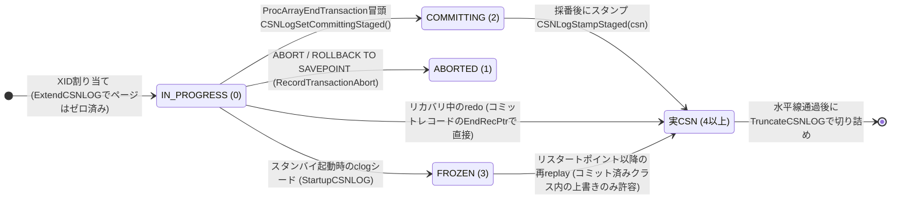

状態遷移の妥当性は `CSNLogAssertTransition()`（csnlog.c）がassertビルドで検査する:
「コミット済み↔アボート」の遷移だけは絶対に起こってはならない。

### 3.2 pg_csnlog SLRU

- 実体は `$PGDATA/pg_csnlog/` 配下のセグメントファイル群（pg_subtrans等と同じSLRU）。
- 1ページ（`BLCKSZ`=8192B）に **1024 XID分**（8B/xid）。`TransactionIdToPage(xid) = xid / 1024`。
- バッファ数は `SimpleLruAutotuneBuffers(512, 1024)` で自動決定（**GUCは意図的に設けていない**。
  参照頻度が「未ヒントタプルにつき1回」でclogと同等なため）。
- **クラッシュ耐性は不要**（pg_subtransと同じ理屈）: プライマリのクラッシュ後は
  実行中トランザクションが存在しないため、以後のどのスナップショットのxminよりも
  古いXIDのエントリは参照されない。よってWALレコードを持たず、
  basebackupからも除外される（§7でスタンバイ側の再構築を説明）。

### 3.3 共有メモリ上のカウンタとフィールド

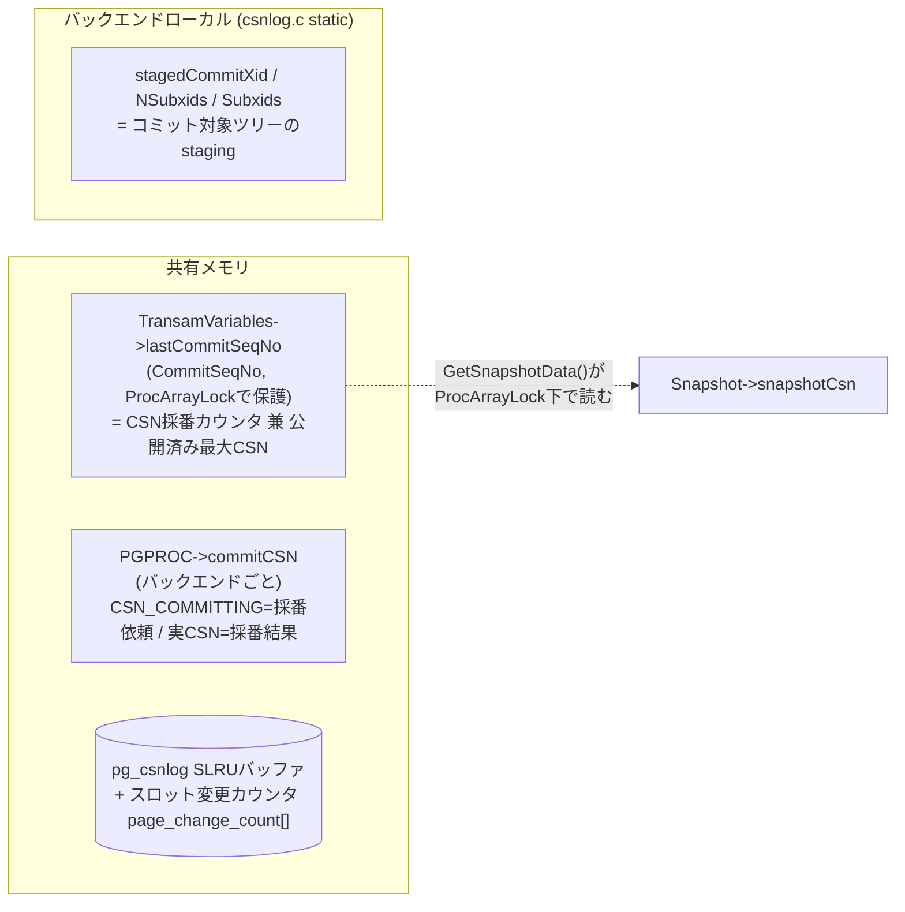

- **`lastCommitSeqNo`**: プライマリでは「公開のたびに `++` される採番カウンタ」であり、
  同時に「スナップショットが読む公開済み最大CSN」。この2役が同一変数なのが
  一貫性の要（§5, §6）。`latestCompletedXid` と**同じProcArrayLock保持区間**で更新される
  ため、スナップショットの `xmax` と `snapshotCsn` は常に相互整合する。
- **`PGPROC.commitCSN`**: グループXIDクリア（`ProcArrayGroupClearXid`）でリーダーが
  メンバーの代わりに採番するため、採番の「依頼→結果」の受け渡しに使う。
- **staging（バックエンドローカル）**: コミットの完全なsubxidリスト
  （PGPROCキャッシュは64個で溢れるが、こちらは完全）は
  `RecordTransactionCommit()` の時点でしか手に入らないため、そこで退避しておき、
  `ProcArrayEndTransaction()` がそれを使ってCOMMITTINGマークとスタンプを行う。
  リストの実体は `xactGetCommittedChildren()` が返す TopTransactionContext 上の
  配列で、トランザクション終了まで有効。

---

## 4. 可視性判定パス

### 4.1 呼び出し構造

`XidInMVCCSnapshot()` の**外部契約は一切変えていない**
（「そのXIDはスナップショット時点でまだ実行中だったか」を返す）。
呼び出し元の `heapam_visibility.c`（`HeapTupleSatisfiesMVCC` 等）は無変更である。
これがPhase 0で入口を一本化した理由で、内部実装だけを差し替えられる。

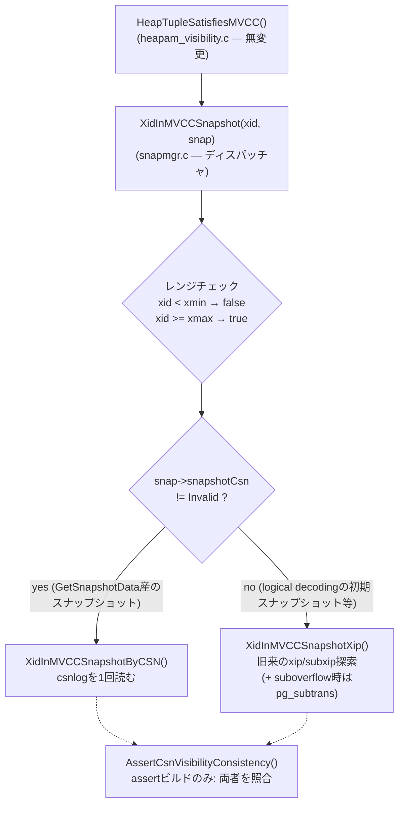

`snapshotCsn == InvalidCommitSeqNo` になるのは `GetSnapshotData()` を通らずに
組み立てられたスナップショットだけである（`SnapBuildInitialSnapshot()` などの
logical decoding系。これらは `palloc0` されるためフィールドは自然に0）。
そのケースでは従来のxip表現で正しく動く。

### 4.2 CSN判定の中身

```c
/* snapmgr.c */
static bool
XidInMVCCSnapshotByCSN(TransactionId xid, Snapshot snapshot)
{
    CommitSeqNo csn = CSNLogGetCommitSeqNoWait(xid);  /* COMMITTINGなら待つ */

    if (csn == InvalidCommitSeqNo)
        return true;    /* 実行中(またはクラッシュ) → 「まだ走っている」 */
    if (csn == CSN_ABORTED)
        return false;   /* 呼び出し元がpg_xactを見てアボートと判定する */
    if (csn == CSN_FROZEN)
        return false;   /* スタンバイ開始前のコミット → 全スナップショットに可視 */

    return csn > snapshot->snapshotCsn;  /* スナップショット後のコミットなら「実行中」扱い */
}
```

戻り値の意味付けが呼び出し元の期待と噛み合う理由:

| エントリ | 戻り値 | 呼び出し元の後続動作 | 結果 |
|---|---|---|---|
| 実CSN ≤ snapshotCsn | false | `TransactionIdDidCommit()`→true | **可視** |
| 実CSN > snapshotCsn | true | （snapshot的に実行中） | 不可視 |
| IN_PROGRESS | true | 同上 | 不可視 |
| ABORTED | false | `DidCommit`→false, `DidAbort`→true | 不可視＋INVALIDヒント |
| FROZEN | false | `DidCommit`→true | 可視 |

注意点:
- **自分自身のXID**: csnlog上はIN_PROGRESSなのでtrueが返るが、
  `XidInMVCCSnapshot()` の契約上、呼び出し元は先に
  `TransactionIdIsCurrentTransactionId()` を確認するため問題にならない
  （snapmgr.cの関数コメント参照）。
- **クラッシュしたXID**: エントリは永久にIN_PROGRESSだが、クラッシュ後の再起動で
  全スナップショットのxminがそれらを追い越すため、レンジチェックで
  csnlogに到達しない（＝clog経由の従来パスでヒントも付く）。
- **ヒントビットは従来どおり機能**する。csnlog参照が起きるのは
  「xmin/xmaxがスナップショット窓内にある未ヒントタプル」だけで、
  アクセス特性はpg_xact（clog）と同等。

---

## 5. コミットプロトコル（CSNの採番と公開）

### 5.1 プライマリの通常コミット

最重要の不変条件は次の1つである:

> **CSNの順序 ≡ トランザクションが「実行中の集合」から外れた順序（公開順）**

これを構成的に保証するため、CSNは `ProcArrayEndTransaction()` が
ProcArrayLock排他下でXIDをプロカレイから外す**まさにその場所**で
`++lastCommitSeqNo` により採番される。スナップショットは同じロック下で
`lastCommitSeqNo` と `xmax`（latestCompletedXid）を読むため、
「CSN的には可視なのにxipにまだ居る」といった矛盾が構造的に起こらない。

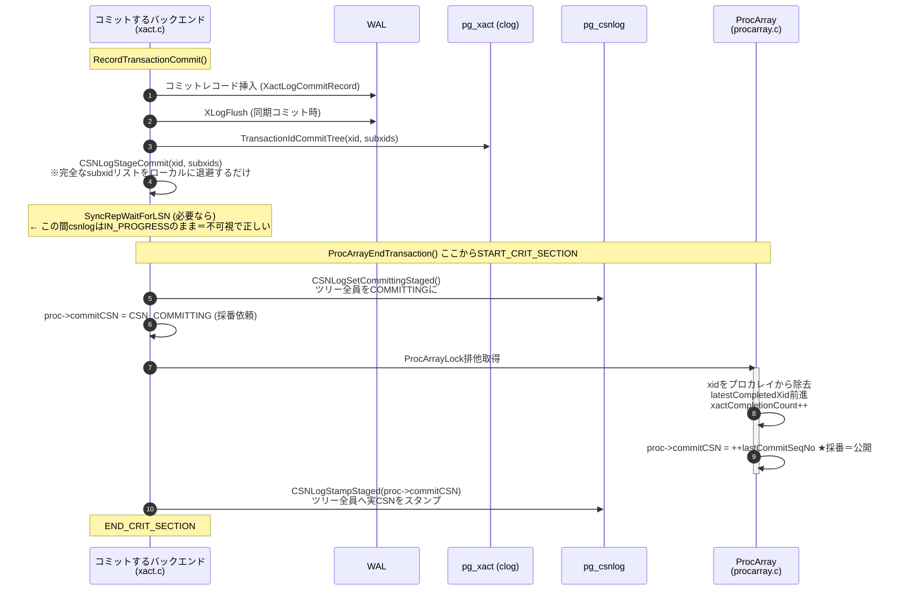

設計上のポイント:

- **stagingが必要な理由**: 採番点（procarray.c）ではsubxidの完全リストが
  手に入らない（PGPROCキャッシュは64個で溢れる）。コミットレコードを書く
  `RecordTransactionCommit()` だけが完全なリスト（`xactGetCommittedChildren()`）を
  持つので、そこで退避する。
- **COMMITTINGマークが必要な理由**: 採番（★）とスタンプの間に別の読者が
  エントリを見ると、IN_PROGRESS（=不可視）と誤読する。採番後のスナップショットは
  `snapshotCsn ≥ このCSN` なので本当は可視でなければならない。COMMITTINGを
  見た読者は `CSNLogGetCommitSeqNoWait()` でスピン待ちする。
  **この窓にはWAL flushや同期レプリケーション待ちを含まない**
  （それらはstagingより前に完了している）ので、待ちは
  「ロック取得＋グループクリアのリーダー待ち＋SLRUストア」程度の短さで、
  スピンで十分。
- **critical sectionの理由**: 採番済み（公開済み）なのにスタンプ前に
  バックエンドが死ぬと、COMMITTINGを見た読者が永遠に待つ。crit section中の
  エラーはPANICになり、クラッシュリカバリでcsnlogは無関係になる（§3.2）ので安全。
- **アボート**: 採番不要。`RecordTransactionAbort()`（トップ/サブ共通）が
  `TransactionIdAbortTree()` の直後に `CSN_ABORTED` をスタンプするだけ。
  アボートはいつ見えても「不可視」なので同期点が要らない。

### 5.2 グループXIDクリアとの合流

ProcArrayLockが混んでいる場合、既存のグループXIDクリア
（`ProcArrayGroupClearXid()`）でリーダーが複数バックエンドのXIDをまとめて外す。
採番もリーダーが代行する。

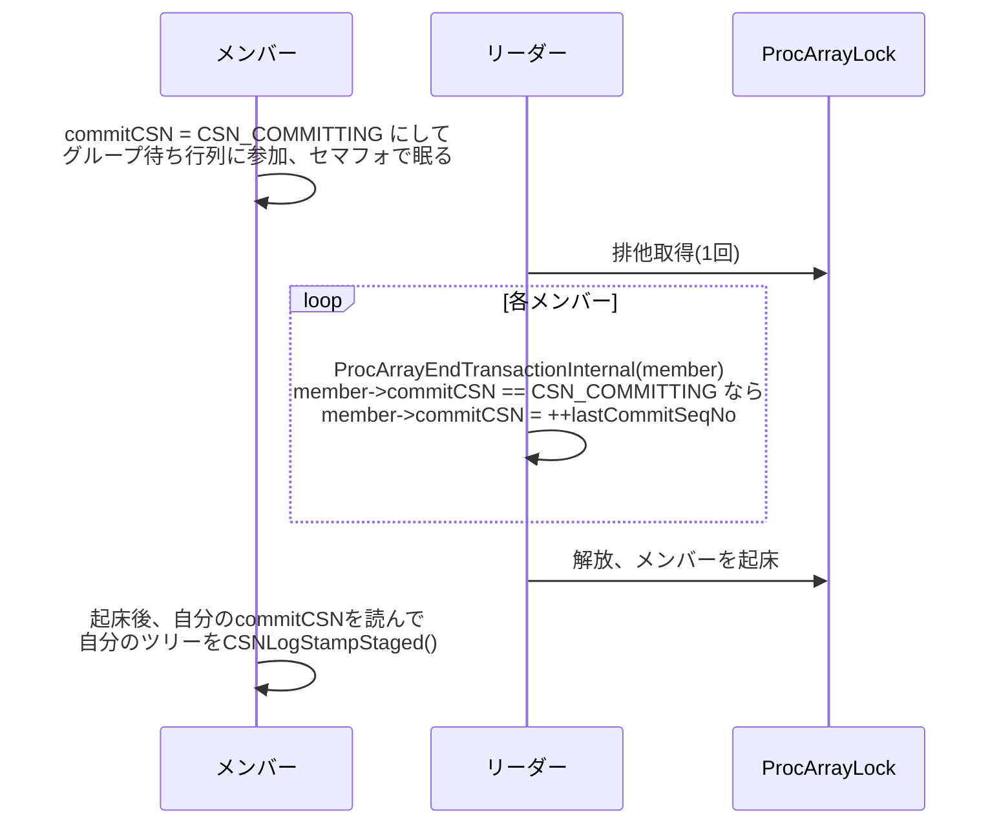

メンバーのstagingはメンバー自身のローカルメモリにあるため、
スタンプは必ず本人が行う（リーダーは他人のsubxidリストを読めない）。
この分担が「採番＝共有ロック下の整数インクリメント」「スタンプ＝ロック外のSLRU書き」
という綺麗なコスト分離にもなっている。

### 5.3 二相コミット（2PC）

`FinishPreparedTransaction()`（twophase.c）では、プロカレイからの除去が
`ProcArrayRemove()` なので、そこに採番を追加した:

```c
if (isCommit)
{
    START_CRIT_SECTION();
    CSNLogSetCommitting(xid, hdr->nsubxacts, children);
    ProcArrayRemove(proc, latestXid, &commitCsn);   /* ロック下で ++lastCommitSeqNo */
    CSNLogSetCommitSeqNo(xid, hdr->nsubxacts, children, commitCsn);
    END_CRIT_SECTION();
}
else
    ProcArrayRemove(proc, latestXid, NULL);
```

PREPARE済みトランザクションはcsnlog上IN_PROGRESSのまま（＝不可視）で、
COMMIT PREPAREDの瞬間に上記の通常プロトコルに合流する。
subxidリストは2PC状態データ（`children`）にあるためstagingは不要。

---

## 6. なぜ「CSN＝コミットレコードLSN」ではダメだったか

当初設計は「CSN＝コミットレコード終端LSN」だった。これはPhase 1の
shadow検証が即座に反例を出して棄却された。**後から同じ轍を踏まないための記録**。

問題は「WAL挿入順」と「公開順（プロカレイから外れる順）」が一致しないこと:

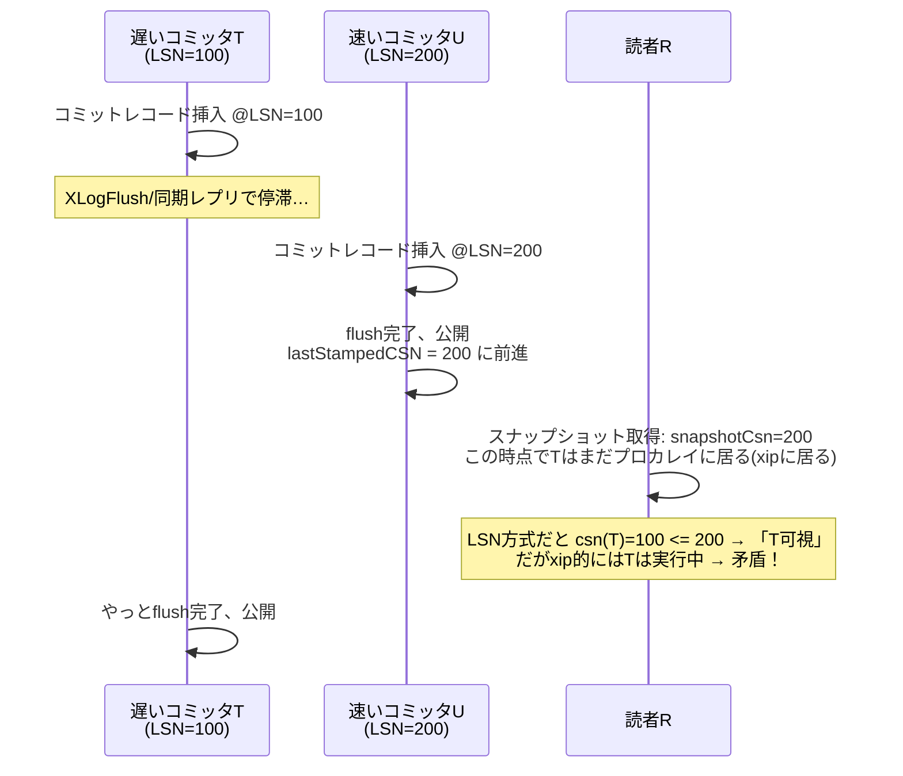

つまりLSNをCSNにすると「まだコミットが完了していない（公開されていない）
トランザクションを可視と判定する」スナップショットが作れてしまう。
修正後の方式では、CSNは公開の瞬間に採番されるので
**「csn ≤ snapshotCsn ⇒ そのスナップショット取得前に公開済み」が定義から成立**する。

なお**スタンバイでは公開順＝リプレイ順＝WAL順**なので、コミットレコードの
終端LSNをそのままCSNに使ってよい（§7）。プライマリのカウンタ値とスタンバイの
LSN値という2つの数直線は、次の2点で相互単調性が保たれる:

1. 起動時にカウンタを `checkPoint.redo`（LSN）でシードし、リカバリ終了時に
   `EndOfLog` まで引き上げる（xlog.c）。
2. カウンタはコミット1件で+1しか進まないのに対し、コミットは1件で最低でも
   数十バイトのWALを書くため、**カウンタが実LSNを追い越すことはない**。
   よって次回シード値（そのときのLSN）≧ 旧カウンタ値が常に成り立つ。

---

## 7. リカバリとホットスタンバイ

### 7.1 スタンバイ上のスタンプと公開

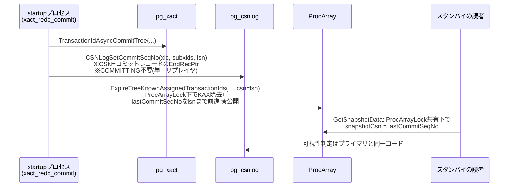

スタンプ（不可視のまま）→公開（ProcArrayLock下）の順序なので、
読者が「公開済みなのにIN_PROGRESSに見える」ことはなく、
スタンバイではCOMMITTING状態自体が発生しない。

これにより、旧来の「`lastOverflowedXid` が進むと**スタンバイの全スナップショットが
suboverflowed になり全読者がpg_subtransへ落ちる**」という病理は構造ごと消えた。

### 7.2 リプレイ窓より前に完了したトランザクションの扱い

スタンバイはbasebackupに `pg_csnlog` を含まない（ゼロから再構築する）。
しかしリプレイ開始点より**前**にコミット済みのXIDは、コミットレコードが
リプレイされないためスタンプの機会がない。スタンバイのクエリはそれらを
参照しうる（スナップショットのxminは `oldestActiveXid` まで下がる）ので、
起動時に pg_xact からシードする:

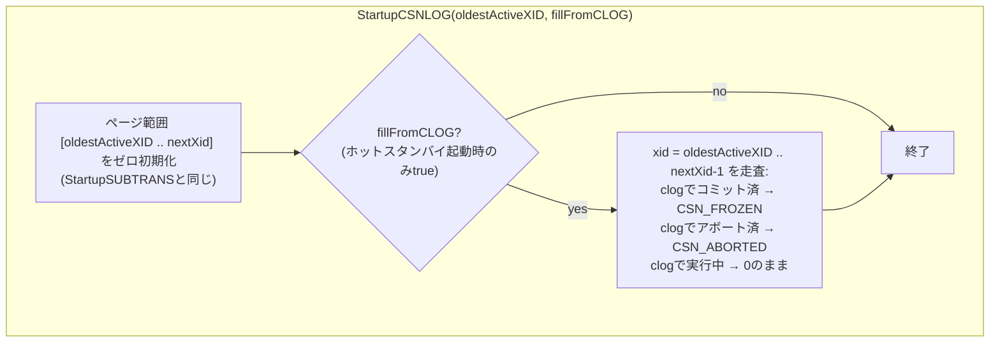

- `CSN_FROZEN`＝「全スナップショットに可視」。スタンバイのどのスナップショットも
  リカバリ開始後に生まれるので、開始前のコミットが全員に可視なのは正しい。
- clog上「実行中」のXIDは0のまま残す。それは (a) プライマリでまだ実行中
  （後でコミットレコードがリプレイされ正規スタンプされる）か、
  (b) 旧プライマリでクラッシュした（永久に不可視でよい）かのどちらかで、
  どちらも0（IN_PROGRESS）の意味論と一致する。
- リスタートポイントからの再リプレイで FROZEN → 実CSN の上書きが起こるが、
  「コミット済み」クラス内の上書きなので無害（`CSNLogAssertTransition`が許容）。

### 7.3 lastCommitSeqNoの初期化タイムライン

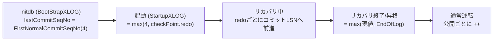

---

## 8. pg_csnlogのライフサイクル

pg_subtransのライフサイクルと意図的に同型にしてある。対比で覚えるのが早い。

| イベント | フック | 内容 |
|---|---|---|
| initdb | `BootStrapCSNLOG()` (xlog.c BootStrapXLOGから) | 最初のページをゼロ書き |
| XID割り当て | `ExtendCSNLOG(xid)` (varsup.c `GetNewTransactionId`、XidGenLock下) | ページ境界で新ページをゼロ化 |
| スタンバイでのXID観測 | `ExtendCSNLOG` (procarray.c `RecordKnownAssignedTransactionIds` 等2箇所) | 同上（リプレイ側） |
| 起動 | `StartupCSNLOG(oldestActiveXID, fill)` (xlog.c 2箇所) | アクティブ範囲ゼロ化＋(HS時)clogシード |
| チェックポイント | `CheckPointCSNLOG()` | ダーティページ書き出し（fsyncなし、正しさに不要） |
| チェックポイント時 | `TruncateCSNLOG(oldestXmin)` (xlog.c 2箇所) | pg_subtransと同じ水平線で切り詰め |
| basebackup | `excludeDirContents` に登録 | 中身をバックアップしない（再構築可能） |

切り詰め水平線は `GetOldestTransactionIdConsideredRunning()`。
どのスナップショットも自分のxminより古いXIDをcsnlogに問い合わせないという、
pg_subtransと同一の保証に乗っている。

---

## 9. ロックフリー読み（SLRU seqlock）

可視性ホットパスの `CSNLogGetCommitSeqNo()` は、通常SLRUのロックを一切取らない。
slru.cに汎用の仕組みを追加した。

### 9.1 プロトコル

各バッファスロットに変更カウンタ `page_change_count[]` を追加。
**「スロットの内容が、それまで保持していたページと対応しなくなる遷移」**
（別ページへのclaim、ゼロ化、無効化、read失敗）の直前にのみ、
バンクロック排他下でインクリメントする。書き出し（内容は不変）では増やさない。

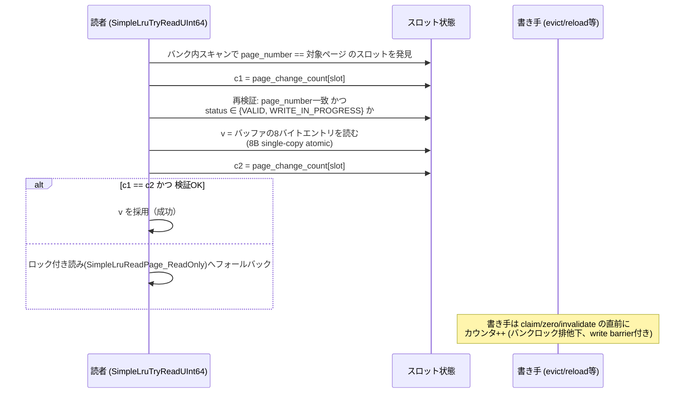

### 9.2 なぜカウンタが必要か（ABA問題）

ステータスの前後チェックだけでは足りない。読者が2命令の間に長時間
デスケジュールされると、次のABAが起こりうる:

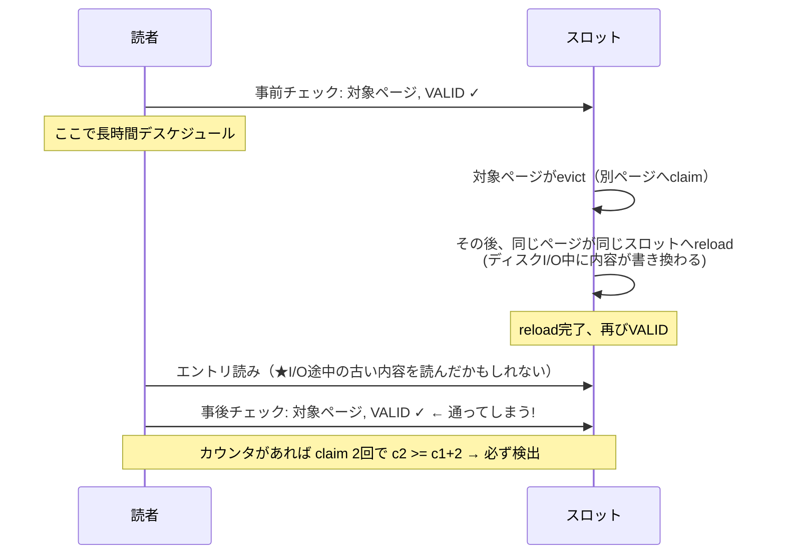

evict時にダーティページは必ず書き出されるため「ディスク上の内容が
バッファより古い」ことは基本的にないが、reload中のI/Oと並行した読みが
更新前の値を返す組み合わせが上の通り存在する。カウンタはこれを機械的に塞ぐ。

### 9.3 例外と前提

- `SimpleLruZeroPage()` は `page_number`/`VALID` を設定**してから** `MemSet` する
  （既存コードの順序）。この「VALIDだが未ゼロ」の瞬間は検証をすり抜けるが、
  **ゼロ化されるページのXIDはまだ誰のスナップショット窓にも入り得ない**
  （`ExtendCSNLOG` はXidGenLock下で、そのXIDが配られる前に走る）ため到達しない。
  この前提はslru.cの関数コメントに明記した。
- 8バイトのsingle-copy atomicityがないプラットフォームでは
  （`PG_HAVE_8BYTE_SINGLE_COPY_ATOMICITY` 未定義）、常にフォールバック側に
  コンパイルされる。
- 成功時も `pg_stat_slru` の `blks_hit` にカウントされるので観測可能。

---

## 10. shadow検証（assertビルドの新旧照合）

`--enable-cassert` ビルドでは、**すべての** `XidInMVCCSnapshot()` 呼び出しで
CSN表現とxip表現の答えを突き合わせる（`AssertCsnVisibilityConsistency()`、snapmgr.c）。
このためassertビルドでは `GetSnapshotData()` が旧来どおりsubxid列挙を続ける
（本番ビルドでは列挙しない — `#ifdef USE_ASSERT_CHECKING`）。

照合ルール:

| csnlogエントリ | 期待されるxip側の答え |
|---|---|
| 実CSN | `in_snapshot == (csn > snapshotCsn)` **（強い検査）** |
| IN_PROGRESS | `in_snapshot == true`（ただしリカバリ中スナップショットは除外※） |
| COMMITTING / ABORTED / FROZEN | 照合スキップ（タイミング依存で両義的。可視性の最終結果は一致する） |
| 自XID | スキップ（xipに自XIDは入らない契約のため） |

※ 旧プライマリでクラッシュしたXIDは、csnlog上IN_PROGRESSだが
KnownAssignedXidsには居ない（どちらのルートでも不可視で結果は同じ）。

この仕組みは開発中に実際に「LSN=CSN方式の追い越しバグ」（§6）を
即検出しており、リグレッション245本・isolation130本・リカバリTAPの
全実行が「全可視性判定の新旧一致」を検証した状態でパスしている。

---

## 11. 残された機構とその役割変化

「消えたわけではないが役割が縮小した」ものを正しく理解しておくこと。

| 機構 | 旧役割 | 新役割 |
|---|---|---|
| `PGPROC`のsubxidキャッシュ(64個)＋overflowedフラグ | スナップショットの subxip 供給源（**溢れると全員に伝染**） | `TransactionIdIsInProgress()`（更新競合パス）の高速化のみ。溢れても他セッションに影響しない。assertビルドではshadow検証の材料 |
| pg_subtrans | 可視性判定のsubxid→topxid解決（ホットパス） | コールドパス専用: `XactLockTableWait()`（行ロック待ちの対象topxid解決）、`TransactionIdDidCommit()`のSUBCOMMITTED追跡、リカバリ中の`TransactionIdIsInProgress()`。**書き込みは全subxidで継続**（遅延化はXactLockTableWait依存のため不採用 — 設計書§8.2） |
| KnownAssignedXids | スタンバイのスナップショットxip供給源＋xmin追跡＋競合解決 | xmin追跡＋リカバリ競合解決＋リカバリ中の`TransactionIdIsInProgress()`。スナップショットへの列挙は本番ビルドで廃止（xminのみ先頭要素から取得） |
| `Snapshot.subxip/suboverflowed` | 可視性判定の本体 | 本番ビルドでは可視性から完全に切り離し（`suboverflowed=true`を立ててxip表現の整合だけ維持）。物理削除はlogical decoding（historic snapshotがsubxipを別意味で使用）のCSN化後 |
| `lastOverflowedXid` | スタンバイ全スナップショットのsuboverflow化 | 維持されるが可視性は読まない（KAX管理の内部整合用） |

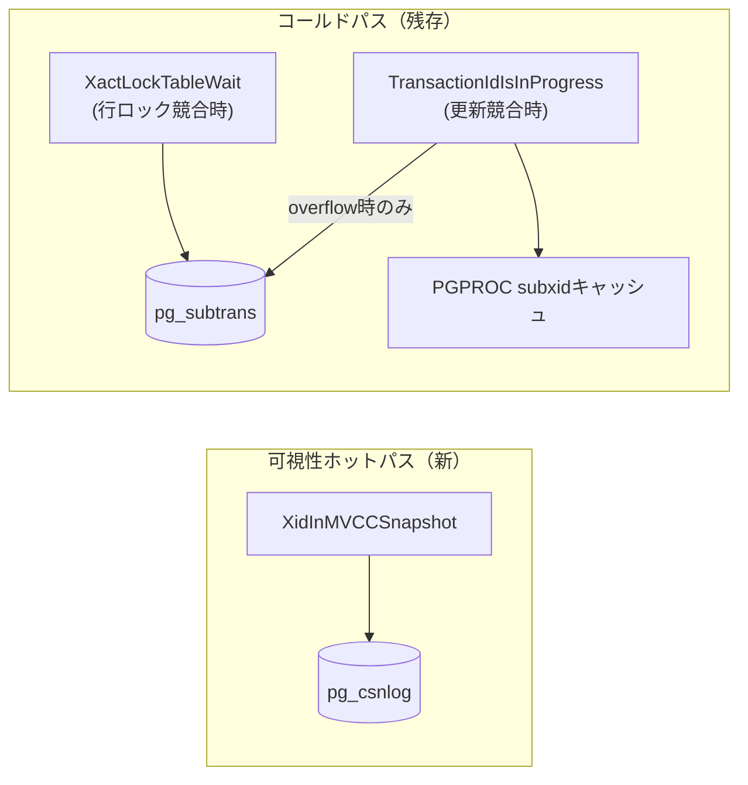

---

## 12. 動作確認・再現手順

### 12.1 suboverflow病理の再現（before/after比較）

ポイントは2つ:
(1) subxidを65個以上持つトランザクションを**openのまま**にする、
(2) **他のコミットを進めて**スナップショットのxmaxがそれらsubxidを追い越すようにする
（これを忘れるとxmaxレンジチェックで弾かれてsubtransに到達せず、病理が再現しない）。

```sql
-- セッションA: 2M行を100個のサブトランザクションで更新し、openのまま保持
BEGIN;
DO $$ BEGIN
  FOR i IN 0..99 LOOP
    BEGIN
      UPDATE t SET b = b + 1 WHERE a > i*20000 AND a <= (i+1)*20000;
    EXCEPTION WHEN OTHERS THEN NULL;  -- 各ブロックがsubxactになる
    END;
  END LOOP;
END $$;
SELECT pg_sleep(120);  -- openのまま

-- セッションB: xmaxを進める（小さいコミットを150回程度）
INSERT INTO bump VALUES (1);  -- ×150

-- セッションC: 測定
SELECT blks_hit+blks_read FROM pg_stat_slru WHERE name IN ('subtransaction','csnlog');
\timing on
SELECT count(*) FROM t;   -- 全行の可視性判定が発生
```

パッチ適用後は `subtransaction` の増分が0になり、スキャンが約1.9倍速くなる。

### 12.2 テストスイート

```bash
./configure --enable-cassert --enable-debug --enable-depend --enable-tap-tests ...
make check                                   # コア245本（shadow検証込み）
make -C src/test/isolation check             # 130本（subxid-overflow.spec含む）
make -C src/test/recovery check \
  PROVE_TESTS='t/001_stream_rep.pl t/009_twophase.pl t/012_subtransactions.pl'
```

assertビルドで走らせること自体に意味がある（全可視性判定が新旧照合される）。

### 12.3 観測ポイント

- `pg_stat_slru` に `csnlog` 行が増えている。ロックフリー読み成功も `blks_hit` に計上。
- `pg_ls_dir('pg_csnlog')` でセグメントファイルを確認できる。
- 待機イベント: `CSNLogBuffer`（I/O）, `CSNLogSLRU`（バンクロック。
  ロックフリー読みのおかげで読み側ではほぼ出ない）。

---

## 付録: 主要関数クイックリファレンス

| 関数 | 場所 | 一言 |
|---|---|---|
| `CSNLogGetCommitSeqNoWait(xid)` | csnlog.c | 可視性用の読み。COMMITTINGならスピン待ち |
| `CSNLogGetCommitSeqNo(xid)` | csnlog.c | 生読み（ロックフリー→ロックの順で試す） |
| `CSNLogSetCommitSeqNo(xid, n, subxids, csn)` | csnlog.c | ツリー一括スタンプ（ページ単位にまとめて書く） |
| `CSNLogStageCommit / SetCommittingStaged / StampStaged` | csnlog.c | コミットプロトコルの3点セット（§5.1） |
| `StartupCSNLOG(oldest, fill)` | csnlog.c | ゼロ化＋(HS時)clogシード |
| `XidInMVCCSnapshotByCSN(xid, snap)` | snapmgr.c | CSN可視性判定の本体 |
| `AssertCsnVisibilityConsistency(...)` | snapmgr.c | shadow検証 |
| `ProcArrayEndTransactionInternal(...)` | procarray.c | **CSN採番点**（`++lastCommitSeqNo`） |
| `ProcArrayRemove(proc, xid, &csn)` | procarray.c | 2PC用の採番点 |
| `ExpireTreeKnownAssignedTransactionIds(..., csn)` | procarray.c | スタンバイの公開点 |
| `SimpleLruTryReadUInt64(ctl, page, entry, &v)` | slru.c | seqlockロックフリー読み |
| `SlruBumpChangeCount(shared, slot)` | slru.c | スロット変更カウンタのインクリメント |
