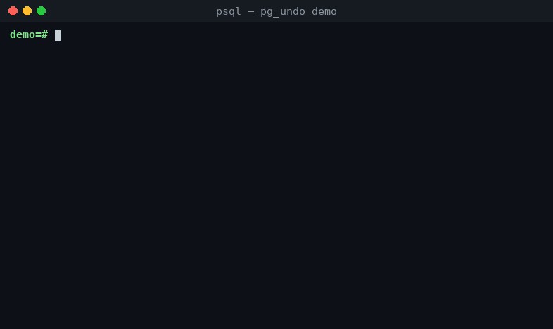

# pg_undo — Ctrl+Z for PostgreSQL



**Undo accidental DML with one SQL call.** pg_undo captures old/new row
images of tracked tables through logical decoding into an in-database
history, and can generate and apply the inverse operations.

> **Target version: PostgreSQL 19 (19devel / 19beta1) only.**
> The build fails on any other major version by design.

```sql
CREATE EXTENSION pg_undo;
SELECT undo.track('users');

-- ... disaster strikes ...
DELETE FROM users;              -- forgot the WHERE!

SELECT * FROM undo.recent_changes('users', '10 minutes');
SELECT * FROM undo.preview(last => '10 minutes', "table" => 'users');
SELECT * FROM undo.apply(last => '10 minutes', "table" => 'users');
--  applied | skipped | conflicts
-- ---------+---------+-----------
--    48213 |       0 |         0

-- even DROP TABLE goes to a recycle bin (v0.2)
DROP TABLE users;
-- NOTICE: pg_undo: moved table "public.users" to the recycle bin
SELECT undo.restore_dropped('users');

-- and you can just look at the past (v0.3)
SELECT * FROM undo.as_of(NULL::users, now() - interval '1 hour');
```

## How it works

A background worker (started via `shared_preload_libraries`) consumes a
logical replication slot **in-process** — no walsender, no network. The
bundled output plugin buffers old/new row images of committed
transactions in memory; the worker then writes them to `undo.history` in
its own transaction and only afterwards confirms the slot, so a crash
never loses or duplicates history (progress-LSN dedupe).

- `undo.track(t)` sets `REPLICA IDENTITY FULL` so UPDATE/DELETE carry
  complete old rows. Unchanged TOAST values are merged in at capture
  time; images in `undo.history` are always complete.
- `undo.preview(...)` / `undo.apply(...)` generate inverse DML
  (`DELETE`→`INSERT`, `UPDATE`→reverse `UPDATE`, `INSERT`→`DELETE`),
  newest change first, with per-row conflict detection
  (`on_conflict => 'abort' | 'skip' | 'force'`).
- A janitor enforces `pg_undo.retention` and a failsafe: if
  `undo.history` exceeds `pg_undo.max_history_size`, capture pauses
  (with a WARNING) but the slot keeps advancing so WAL never piles up.
  It resumes automatically once space is reclaimed.
- **Time travel** (v0.3): `undo.as_of(NULL::mytable, <timestamptz>)`
  returns the table's rows as they were at that moment, reconstructed
  from history — rows untouched since then come from the live table,
  rows changed or deleted afterwards come from their captured old
  images, and rows inserted afterwards are omitted (primary-key updates
  are handled as delete+insert).  Needs a primary key and a point in
  time within the tracked/retained window; a later `TRUNCATE` makes
  earlier states unreconstructable and is reported as an error.
  `undo.create_snapshot_view('mytable', <ts>)` wraps it in a temporary
  view for ad-hoc digging.
- **Recycle bin** (v0.2): a `ProcessUtility` hook diverts `DROP TABLE`
  into the `undo_trash` schema instead of destroying it — data, indexes,
  sequences, owner and privileges intact (each renamed with an
  oid-suffix so same-named tables can coexist in the bin).
  `undo.restore_dropped(name[, new_name])` brings it back;
  `undo.purge(name)` / `undo.purge_all()` destroy for real; the janitor
  purges entries older than `pg_undo.trash_retention`.  Escape hatches:
  `DROP TABLE ... CASCADE` always bypasses the bin, and superusers can
  `SET pg_undo.recycle_bin = off`.  Temporary tables, partitions,
  extension-owned tables and multi-target drops that include any of
  those fall through to the regular `DROP`.

## Installation

```sh
make PG_CONFIG=/path/to/pg19/bin/pg_config install
```

postgresql.conf:

```
shared_preload_libraries = 'pg_undo'
wal_level = logical
pg_undo.database = 'yourdb'     # database to capture in
```

Restart, then `CREATE EXTENSION pg_undo;` in that database.

## Configuration

| GUC | Default | Meaning |
|---|---|---|
| `pg_undo.database` | `postgres` | Database the worker connects to |
| `pg_undo.enabled` | `on` | Master switch (SIGHUP) |
| `pg_undo.naptime` | `1s` | Capture cycle interval |
| `pg_undo.retention` | `24 hours` | How long history is kept |
| `pg_undo.max_history_size` | `10240` (MB) | Failsafe pause threshold |
| `pg_undo.spill_threshold` | `256` (MB) | Per-transaction capture buffer before spilling to disk |
| `pg_undo.janitor_interval` | `60s` | GC / failsafe check interval |
| `pg_undo.recycle_bin` | `on` | Divert `DROP TABLE` to the bin (superuser-settable) |
| `pg_undo.trash_retention` | `7 days` | How long dropped tables stay restorable |

## SQL API

| Function | Description |
|---|---|
| `undo.track(regclass)` / `undo.untrack(regclass)` | Start/stop capturing a table |
| `undo.recent_changes(regclass, interval)` | Who changed what, with row images |
| `undo.preview(xid, last, since, until, "table")` | Show inverse SQL without executing |
| `undo.apply(..., on_conflict)` | Execute the inverse operations in one transaction |
| `undo.status` (view) | Capture progress, slot position, pause state |
| `undo.as_of(NULL::tbl, ts)` | The table's rows as of a past time |
| `undo.create_snapshot_view(tbl, ts[, name])` | Temp view over `as_of` |
| `undo.trash` (view) | Contents of the recycle bin |
| `undo.restore_dropped(name[, new_name])` | Bring a dropped table back |
| `undo.purge(name)` / `undo.purge_all()` | Empty the recycle bin for real |
| `undo.ready()` | Has capture started (slot exists)? |

## Honest limitations (v0.1)

- One database per cluster (`pg_undo.database`).
- `REPLICA IDENTITY FULL` increases WAL volume for UPDATE/DELETE on
  tracked tables (old rows are logged in full).
- History lives in the same database and consumes disk in proportion to
  write volume × retention. This is **not a backup**: it protects
  against logical mistakes, not media failure.
- `changed_by` in `undo.history` is NULL: WAL does not record the
  acting role (`undo.trash.dropped_by` is recorded, though).
- `TRUNCATE` is recorded but cannot be undone; DDL other than
  `DROP TABLE` is out of scope.
- A binned `DROP TABLE` does not raise the usual RESTRICT dependency
  error and does not fire drop event triggers: dependent objects (views,
  foreign keys) simply follow the table into the bin and keep working
  until it is purged.  Trashed tables are also included in `pg_dump`.
- On restore, index and sequence names keep their oid suffix
  (cosmetic; constraints and serial defaults keep working).
- Transactions larger than `pg_undo.spill_threshold` (default 256MB)
  are spilled to disk during capture, so worker memory stays bounded;
  the spill files live under `base/pgsql_tmp` and are cleaned up
  automatically (also after a crash).
- `undo.as_of` reconstructs data, not schema: columns added since the
  requested time show NULL in reconstructed rows, and a time inside the
  last `pg_undo.naptime` may reflect slightly newer state (capture lag).
- `undo` schema objects are superuser-only by default; anyone can drop
  a table into the bin (ownership required, as with real `DROP`), but
  restore/purge are for superusers unless you `GRANT` otherwise.

## Tests

```sh
make PG_CONFIG=... check       # pg_regress (spins up a temp instance)
make PG_CONFIG=... prove_installcheck   # TAP (restart survival etc.)
```
