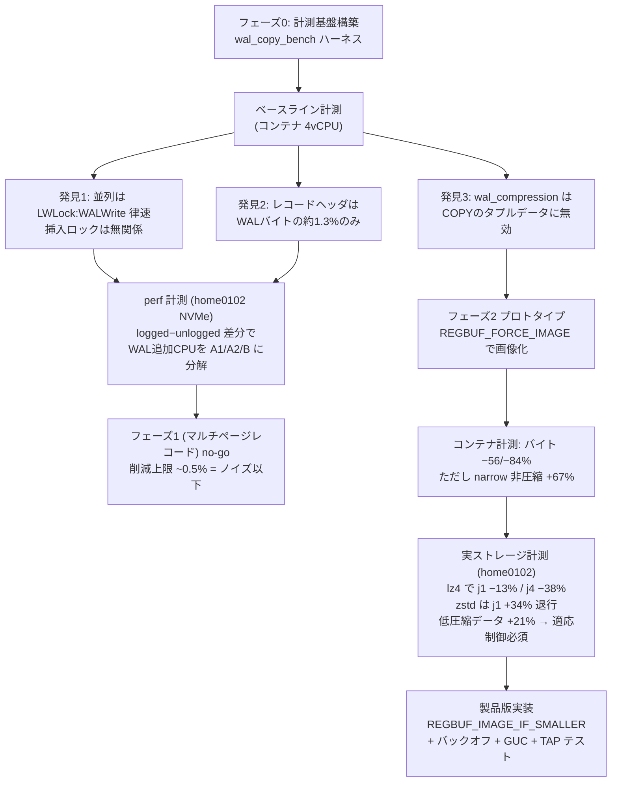
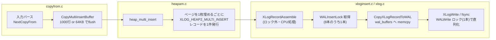
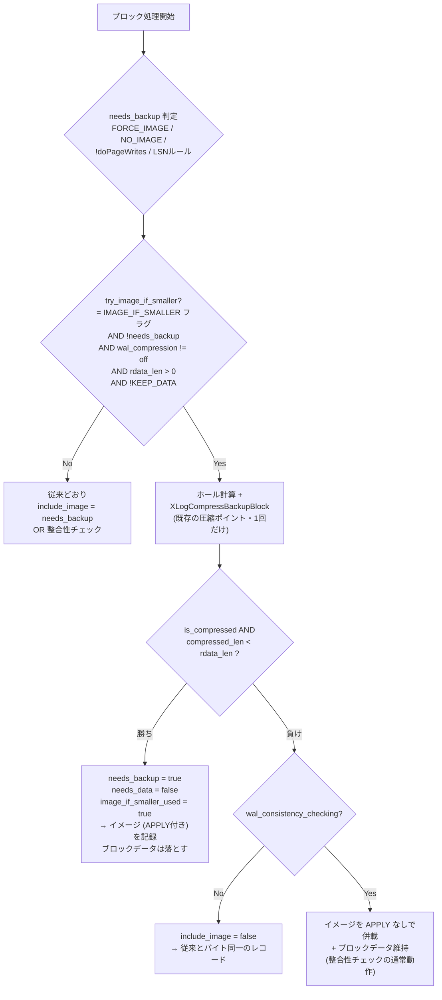
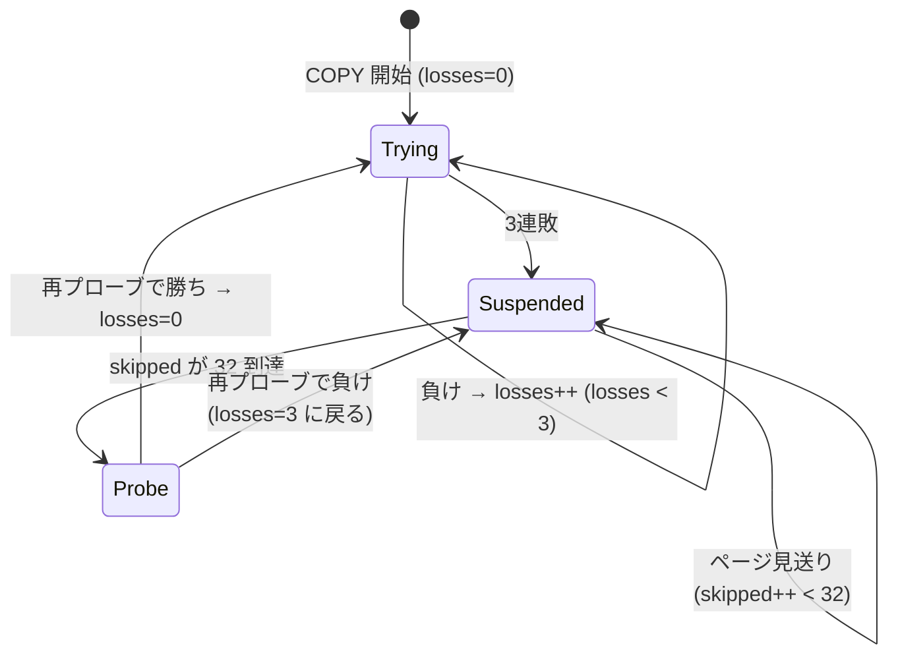
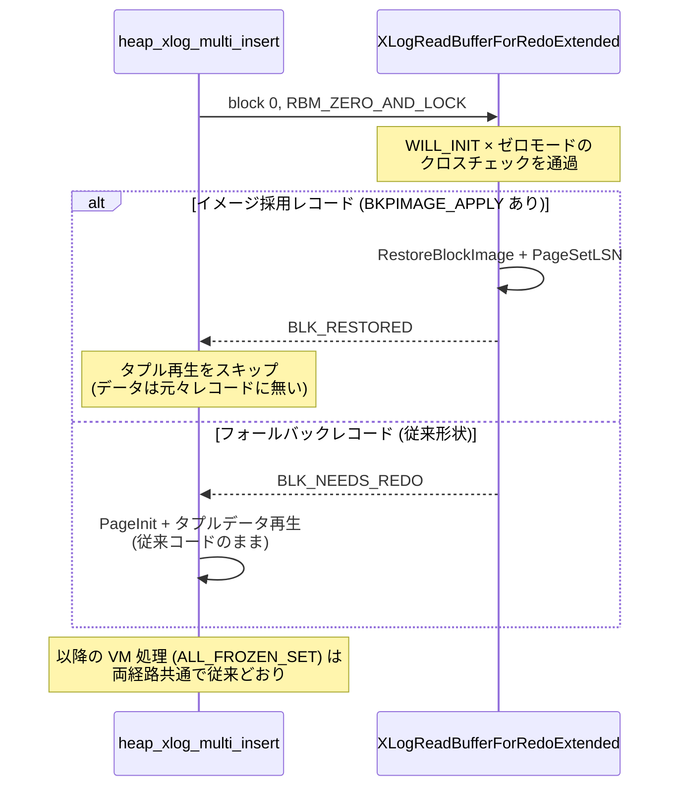

# COPY FROM の WAL ボトルネック改善 — 調査・実装詳細ドキュメント

対象ブランチ: `claude/wal-copy-from-performance-id8a9q`
最終更新: 2026-07-08

このドキュメントは、「COPY FROM で大量レコードをロードする際に WAL 書き込みが
ボトルネックになる」問題に対する一連の調査と実装(計測基盤、ボトルネック分析、
条件付きページイメージ機構)を、後から実装を理解・再開できるレベルで記録する。

---

## 1. 全体像

### 1.1 結論サマリ

- COPY FROM の WAL コストの支配項は **バイト量**。単一セッションでは WAL
  write/fsync 待ち(実ストレージで elapsed の約25%)、並列ロードでは
  **WALWrite ロックの直列化**が天井になる。挿入ロック
  (`NUM_XLOGINSERT_LOCKS`)は無関係(どのプロファイルにも現れない)。
- レコード件数を減らす施策(マルチページレコード化)は **no-go**。レコード
  ヘッダは WAL バイトの約1.3%、削減可能な件数比例 CPU は全体の約0.5%しかない。
- 採用した解は **条件付きページイメージ**: multi-insert がページを満杯に
  したとき、タプルデータの代わりに `wal_compression` で圧縮したページ
  イメージを「小さい場合のみ」記録する。lz4 で WAL −56〜84%、単一セッション
  −13%、並列4 −38%(NVMe 実測)。
- 圧縮が効かないデータには **バックオフ**(3連敗で停止、32ページ毎に再プローブ)
  で試行 CPU を回避し、残留コストを +2% 程度に抑える。

### 1.2 調査の流れ



### 1.3 コミット対応表(このブランチ)

| コミット | 内容 |
|---|---|
| `a216e48` | フェーズ0 計測ハーネス追加 |
| `505466e` | WAL セグメントウォームアップ + wal_buffers 感度ケース |
| `86b15de` | ベースライン結果と分析 (`results/2026-07-07-baseline/`) |
| `46ff789` | XLogInsert perf プロファイル、フェーズ1 no-go 判定 (`results/2026-07-08-perf/`) |
| `84e3250` | プロトタイプ(`debug_multi_insert_page_images`、FORCE_IMAGE 方式) |
| `ef4e048` | プロトタイプのコンテナ計測結果 |
| `2a141d0` | 低圧縮率 `rand` 幅の追加(ハーネス) |
| `f1dbe1b` | 実ストレージでの判定計測結果 (`results/2026-07-08-phase2-home0102/`) |
| `67781a7` | **製品版パッチ1**: xloginsert に `REGBUF_IMAGE_IF_SMALLER` |
| `7845269` | **製品版パッチ2**: heap multi-insert での利用、GUC、バックオフ、redo、TAP、docs |
| `15c20aa` | ハーネスの製品版 GUC 対応 |

---

## 2. 前提知識: COPY FROM の WAL 経路

改善対象を理解するための、変更前のデータフロー。



重要な事実:

- タプルデータは **ブロックデータ**(`XLogRegisterBufData`)として登録される。
  redo・論理デコードとも `XLogRecGetBlockData(record, 0, ...)` で読む。
- 空ページから始まるレコードは `XLOG_HEAP_INIT_PAGE` フラグ +
  `REGBUF_WILL_INIT` になり、オフセット配列を省略する。
- **`REGBUF_WILL_INIT` は `REGBUF_NO_IMAGE` を内包する**(`0x04|0x02`)。
  これが「COPY の init ページが LSN ルールでも FPI を取らない」仕組み。
  ページ LSN が 0 でも `NO_IMAGE` 分岐で needs_backup=false になる。
- WAL レコードのタプルは各23バイトのヒープタプルヘッダを**含まない**
  (`datalen = t_len - SizeofHeapTupleHeader`、redo 側で再構築)。
  per-tuple オーバーヘッドは `xl_multi_insert_tuple` の約5バイトのみ。
  → 非圧縮のページイメージ(フルヘッダ23B+ラインポインタ4B入り)は
  narrow なタプルではタプルデータ形式より **大きくなる**(実測 +67%)。
- copyfrom.c の flush 境界(1000行)でページが分割されるため、
  1ページあたり約1.18レコードになる(満杯 INIT レコード+書きかけページへの
  継続レコード)。

---

## 3. フェーズ0: 計測基盤とボトルネック判定

### 3.1 ハーネス (`run_bench.sh`)

ケース行列(`wal_level × モード × wal_compression × タプル幅 × 並列数 ×
wal_buffers × images`)を回し、ケースごとに以下を採取する:

- 実行時間、rows/s、WAL MB/s
- `pg_stat_wal`(wal_records / wal_fpi / wal_bytes / wal_fpi_bytes /
  wal_buffers_full)。write/fsync 時間は PG18 以降 `pg_stat_io (object='wal')`
- `pg_waldump --stats=record` による正確な LSN 範囲のレコード種別内訳
- **wait event サンプリング**(50ms 間隔で `pg_stat_activity` を `\watch`、
  ロード中バックエンドの待ちの分布 = 簡易プロファイラ)

設計上の要点:

- 全ケースが同一の行数をロードするよう、データはあらかじめ MAX_JOBS 個の
  チャンクに分割生成(j1 は全チャンクを1セッションで、j4 は1チャンクずつ)。
- 初回ケースが新規 WAL セグメントのゼロ埋め(`IO:WalInitWrite`)を被る
  順序バイアスがあるため、**ウォームアップロード(未計測)**で
  セグメントを事前確保する。
- `rand` 幅(base64(/dev/urandom))は圧縮ケースの下限を測る低圧縮率データ。
  生成時は `head -c` でバイト数を切る(`head -n` だと base64 が SIGPIPE で
  死に pipefail で静かに落ちる)。
- 対照ケースは `wal_multi_insert_page_images` を**明示的に off に固定**する
  (製品版 GUC は default on のため)。GUC の有無は
  `postgres -C wal_multi_insert_page_images` でプローブ。

### 3.2 ベースラインの発見(判定に効いたもの)

| 観測 | 数値(コンテナ) | 帰結 |
|---|---|---|
| 並列4の支配的待ちが `LWLock:WALWrite`、`wal_buffers_full` 最大6.2万回 | wide j4 で待ちサンプルの57% | フェーズ3(挿入ロック増加)は的外れ。wal_buffers 増量は 8〜15% 改善するが天井は残る |
| レコードヘッダは1ページあたり約50〜80B | WAL バイトの約1.3% | レコード件数削減はバイトをほぼ減らさない |
| `wal_compression=lz4` で総 WAL 不変 | FPI のみ 31KB→3KB | COPY のタプルデータは今日一切圧縮されない → 圧縮を効かせるにはページイメージ化が必要 |
| unlogged との差 = WAL 総コスト | narrow +29% / wide +121% | wide(バイト大)ほど WAL 律速 |

### 3.3 perf による CPU 分解とフェーズ1 no-go

home0102(NVMe、`-O2 -fno-omit-frame-pointer`)で logged / unlogged の
COPY バックエンドに perf attach し、シンボル別 self-cycles の差分で
WAL 追加 CPU を分解した:

| 区分 | 内容 | 割合 | マルチページ化で削れるか |
|---|---|---|---|
| A1 | レコード件数比例(XLogBeginInsert/Assemble、挿入ロック、~560 cycles/record) | WAL CPU の15%(全体の0.5%) | ○(唯一削れる) |
| A2 | タプル毎のレコード構築(scratch への詰め込み、~9.5 cycles/tuple) | 39% | ×(タプル詰め込みは残る) |
| B | バイト比例(CRC 0.19 c/B + memcpy 0.18 c/B) | 46% | × |

XLogInsert パス全体でも COPY CPU の3.6%に過ぎず、WAL オーバーヘッド(+25%)の
約3/4は off-CPU の write/fsync 待ちだった。→ **フェーズ1の実削減上限は全体の
約0.5%で no-go**。バイト削減(フェーズ2)だけが B・off-CPU 待ち・WALWrite
天井のすべてに効き、ページイメージ化なら A2 も消える。

---

## 4. フェーズ2: 条件付きページイメージ

### 4.1 中核アイデア

multi-insert がページを**満杯にした**とき、そのページの内容は
タプルデータとしてもページイメージとしても等価に WAL に表現できる。
イメージは `wal_compression` の対象になるため、圧縮が効くデータでは
タプルデータより小さくなる。**小さくなる場合だけ**イメージを採用すれば、
バイト増のリスクなしに WAL を圧縮可能にできる。

### 4.2 プロトタイプから製品版への設計変更

| 項目 | プロトタイプ (`84e3250`) | 製品版 (`67781a7`+`7845269`) | 変更理由 |
|---|---|---|---|
| 採用判定 | 無条件(GUC on なら常に画像) | **圧縮後サイズ < ブロックデータ長 のときのみ** | narrow 非圧縮で +67% バイト増(実測)。圧縮後サイズは圧縮を実行するまで不明なので、判定は圧縮が走る場所=アセンブリ層でしか行えない |
| 使用フラグ | `REGBUF_FORCE_IMAGE`(INIT_PAGE を外した別形状レコード) | 新フラグ `REGBUF_IMAGE_IF_SMALLER`(通常形状のまま条件採用) | フォールバック時に従来とバイト同一のレコードになることを構造的に保証。redo も既存パスで両形状を処理できる |
| タプルデータ | 画像時は scratch 詰め込みをスキップ(A2 節約) | 常に詰め込み・登録(負けたとき必要) | 判定がアセンブリ時なので登録は必須。A2 は残るが圧縮 CPU に比べ小さい |
| 低圧縮データ | 毎ページ試行(rand で j1 +21%) | バックオフ(3連敗で停止/32ページ毎再プローブ) | 「小さいときのみ採用」でも負けた試行の圧縮 CPU は払っている |
| GUC | `debug_multi_insert_page_images`(開発用、default off) | `wal_multi_insert_page_images`(WAL_SETTINGS、**default on**) | ポリシー1〜3で退行がほぼ封じられ、`wal_compression` 有効化(=圧縮CPUへのオプトイン)にのみ反応するため |

### 4.3 製品化ポリシー(実ストレージ計測から導出)

1. `wal_compression != off` のときのみ試行(非圧縮イメージは必ず負けるため)。
2. 圧縮イメージがタプルデータより小さいときのみ採用(バイト増ゼロ保証)。
3. 連敗時は試行自体を止める適応制御(圧縮試行 CPU の回避)。
4. 文書でバルクロードには lz4 を推奨(zstd は同じ削減に約5倍の CPU を払い、
   単一セッションでは実ストレージでも +34% 退行する)。

---

## 5. 実装詳細

### 5.1 パッチ1: `REGBUF_IMAGE_IF_SMALLER`(xloginsert)

変更ファイル: `src/include/access/xloginsert.h`,
`src/backend/access/transam/xloginsert.c`

`XLogRecordAssemble()` のブロックごとの処理に、条件付きイメージの
試行・判定を追加した。判定フロー:



実装上のポイント:

- 試行条件に `!needs_backup` を含むため、チェックポイント直後などで
  LSN ルールにより FPI が必須のブロックは従来どおりの経路を通る
  (既存動作: FPI 採取時は KEEP_DATA でない限りブロックデータは落ちる)。
- 判定は圧縮結果が出た直後、`BKPBLOCK_HAS_IMAGE` 設定・`num_fpi` 加算・
  rdata チェイン構築より**前**に行う。負けた場合は画像関連の副作用が
  一切発生しない。
- `image_if_smaller_used` は backend-local static。`XLogBeginInsert()` と
  `XLogRecordAssemble()` 冒頭でリセットする。後者が必要なのは、
  `XLogInsert()` が RedoRecPtr 変化時に**同一レコードを再アセンブル**する
  ためで、リセットしないと前回アセンブルの結果が残留しうる。
  呼び出し側は `XLogInsert()` 復帰後に `XLogImageIfSmallerUsed()` で勝敗を
  照会する。
- `XLogRegisterBuffer()` に `FORCE_IMAGE` との併用を禁じる Assert を追加。
  `WILL_INIT`(⊃NO_IMAGE)との併用は正当(「通常はイメージ不要、ただし
  小さければ採用」の意味になる)。

### 5.2 パッチ2: heap multi-insert での利用(heapam ほか)

変更ファイル: `src/backend/access/heap/heapam.c`,
`src/backend/access/heap/heapam_xlog.c`, `src/include/access/heapam.h`,
`src/include/access/hio.h`, GUC 配線
(`guc_parameters.dat` / `guc_tables.c` / `postgresql.conf.sample`)、
`doc/src/sgml/config.sgml`

#### 試行条件(heap_multi_insert 内)

```c
try_image = wal_multi_insert_page_images &&
    wal_compression != WAL_COMPRESSION_NONE &&   /* ポリシー1 */
    init &&                                       /* 空ページから開始 */
    !need_tuple_data &&                           /* 論理デコード不要 */
    !need_cids &&                                 /* カタログ除外 */
    ndone + nthispage < ntuples &&                /* ページ満杯 */
    multi_insert_image_try(bistate);              /* バックオフ */
```

- 「ページ満杯」は「タプル配置ループが空き不足で停止した」ことと同値
  (`ndone + nthispage < ntuples`)。バッチ最後の書きかけページは対象外。
  これは**同一ページの再イメージ化(二重計上)を防ぐ**ための必須条件:
  copyfrom.c は1000行ごとに flush するため、書きかけページには次の flush が
  追記し、それを画像化するとページ全体をもう一度書くことになる。
- レコードは常に通常形式(`XLOG_HEAP_INIT_PAGE` + `REGBUF_WILL_INIT` +
  タプルデータ登録)で構築し、`try_image` のときに
  `REGBUF_IMAGE_IF_SMALLER` を加えるだけ。フォールバック時のレコードは
  GUC off のものとバイト同一。

#### バックオフ(ポリシー3)

状態は `BulkInsertState`(1つの COPY 実行を通じて生存)に置く:
`image_losses`(連敗数)と `image_pages_skipped`(停止中に見送ったページ数)。



- 再プローブは `losses = MAX_LOSSES - 1` にセットして**1回だけ**試行を許す
  (0 に戻すと3ページ分の無駄な試行を毎回払う)。
- 定数: `MULTI_INSERT_IMAGE_MAX_LOSSES = 3`, `MULTI_INSERT_IMAGE_REPROBE = 32`。
  低圧縮データの残留コストは試行 1/32 ページ ≒ elapsed +2% 程度(実測は
  プロトタイプの毎ページ試行で +21% だった)。
- 勝敗のフィードバックは `XLogInsert()` 直後に `XLogImageIfSmallerUsed()` を
  読んで反映(クリティカルセクション内だがローカルメモリのカウンタ更新のみ)。
- `bistate == NULL` の呼び出し(現状 COPY 以外にほぼ無い)は毎回試行。

#### redo の変更(1箇所のみ)と、検証で踏んだ PANIC

`heap_xlog_multi_insert()` の INIT ページ分岐。変更前はこうだった:

```c
if (isinit)
{
    buffer = XLogInitBufferForRedo(record, 0);
    PageInit(...);
    action = BLK_NEEDS_REDO;      /* 無条件にタプル再生へ */
}
```

イメージ採用レコードは INIT_PAGE フラグを保持したままなので、この分岐が
イメージを無視して `PageInit` → タプルデータ(存在しない)を再生しようとして
壊れる。**最初の修正案**(イメージ付きなら `XLogReadBufferForRedo` を呼ぶ)は
クラッシュリカバリ検証で以下の PANIC を踏んだ:

```
PANIC: block with WILL_INIT flag in WAL record must be zeroed by redo routine
```

原因: `XLogReadBufferForRedoExtended()` は WILL_INIT ブロックに対して
ゼロモード(`RBM_ZERO_AND_LOCK`)での呼び出しを**イメージ適用より前に**
強制するクロスチェックを持つ。正しい形は「ゼロモードで呼び、返り値で分岐」:

```c
if (isinit)
{
    action = XLogReadBufferForRedoExtended(record, 0, RBM_ZERO_AND_LOCK,
                                           false, &buffer);
    if (action == BLK_NEEDS_REDO)     /* イメージなし → 従来どおり */
    {
        page = BufferGetPage(buffer);
        PageInit(page, BufferGetPageSize(buffer), 0);
    }
    /* BLK_RESTORED ならイメージが復元済み、再生することは何もない */
}
```



- VM(COPY FREEZE の `XLH_INSERT_ALL_FROZEN_SET`)はレコードのブロック1で
  従来どおり処理される。イメージには `PD_ALL_VISIBLE` 設定済みのページが
  写っている(イメージ採取はページ更新後)ので整合する。
- `wal_consistency_checking` のイメージは APPLY なしなので、この分岐は
  従来レコードでは決して RESTORED 側に入らない。

#### GUC 配線

master では GUC は `src/backend/utils/misc/guc_parameters.dat` に宣言する
(`gen_guc_tables.pl` がテーブルを生成)。変数実体は heapam.c、extern は
heapam.h、`guc_tables.c` に `#include "access/heapam.h"` を追加。
`postgresql.conf.sample` と `config.sgml` にも記載(lz4 推奨の注記込み)。

- 名称: `wal_multi_insert_page_images`、type bool、context `PGC_SUSET`
  (wal_compression と同じ)、group `WAL_SETTINGS`、**boot_val true**。
  default on の根拠: `wal_compression=off`(既定)では完全に無効であり、
  圧縮を有効にした管理者は FPI 圧縮の CPU コストに既にオプトインしている。

### 5.3 WAL レコード形状の比較

```
[従来 / フォールバック時]  XLOG_HEAP2_MULTI_INSERT (+INIT)
  main data : xl_heap_multi_insert (flags, ntuples) [+ offsets(非INITのみ)]
  block 0   : WILL_INIT, ブロックデータ = xl_multi_insert_tuple + タプル本体 (×n)
  block 1   : (FREEZE時のみ) VM ページ

[イメージ採用時]           XLOG_HEAP2_MULTI_INSERT (+INIT)  ← info は同一
  main data : xl_heap_multi_insert (flags, ntuples)          ← 同一
  block 0   : WILL_INIT + HAS_IMAGE + BKPIMAGE_APPLY
              圧縮ページイメージ (pglz/lz4/zstd)、ブロックデータなし
  block 1   : (FREEZE時のみ) VM ページ                        ← 同一
```

`pg_waldump --stats=record` では両者とも `Heap2/MULTI_INSERT+INIT` に
分類され、採用分は FPI size 列に現れる(採用率の観測に使える)。
`pg_stat_wal.wal_fpi` / `wal_fpi_bytes` でも観測可能。

---

## 6. 正当性検証(実施済みの全項目)

| 検証 | 方法 | 結果 |
|---|---|---|
| 内容の同一性 | GUC on/off で同一データを COPY し全行 md5 比較 | 一致 |
| クラッシュリカバリ | `pg_ctl stop -m immediate` → 再起動 → md5 再検証。採用形状・フォールバック形状・FREEZE の3種 | 一致(初回は §5.2 の PANIC を検出し修正) |
| VM / FREEZE | `pg_visibility` で all_frozen ページ数を GUC off 対照と比較 | 1082/1120 で完全一致(未凍結38ページは既存挙動) |
| リグレッション | `make check` 245本 × 3構成: (a) GUC 強制 on、(b) +`wal_compression=pglz`、(c) +`wal_consistency_checking=heap2` | 全パス |
| スタンバイ再生 | 新規 TAP `src/test/recovery/t/055_multi_insert_page_images.pl`(圧縮可能/不可能データ + FREEZE をストリーミングレプリカで再生+クラッシュリカバリ) | パス |
| フォールバックの無害性 | rand データで pg_waldump 確認: FPI 0 バイト、レコード形状は対照と同一 | 確認 |
| コードスタイル | pgindent 適用 | 済 |

TAP テストの注意: `PostgreSQL::Test::Cluster::psql` に `stdin` パラメータは
無いため、COPY データは SQL 文字列に `\.` 終端で埋め込む
(kerberos の 001_auth.pl と同じイディオム)。

---

## 7. 計測結果サマリ

### 7.1 WAL バイト(環境非依存・正確)

| ケース | 対照 | 施策後 | 削減率 |
|---|---|---|---|
| narrow (bigint×2) 10M行, img+zstd | 245.1MB | 107.7MB | −56% |
| wide (~1KB text) 600k行, img+zstd | 612.1MB | 99.4MB | −84%(合成データ、実データでは変動) |
| narrow, img のみ非圧縮(プロトタイプ) | 245.1MB | 409.4MB | **+67%** → ポリシー1の根拠 |
| wide, zstd のみ(img なし) | 612.1MB | 611.9MB | ±0% → 「タプルデータは非圧縮」の実証 |

### 7.2 実行時間(home0102 / NVMe、最終計測 = 製品版そのもの、3反復中央値)

`results/2026-07-08-phase2-final-home0102/report.md` が -hackers 用の確定値。

| ケース(lz4) | WAL bytes | elapsed | 備考 |
|---|---|---|---|
| narrow j1 | −22.1% | **+13.2%**(1.775→2.009s) | 唯一の実退行。narrow は CPU バウンド(WAL 待ちは elapsed の~7%)で、圧縮が毎回勝つため CPU を払い続ける |
| narrow j4 | −22.2% | **+8.0%**(0.664→0.717s) | 同上(j4 の反復ばらつきは最大8%でこの値はやや粗い) |
| wide j1 | −80.2% | **−11.9%**(1.263→1.113s) | WAL fsync 278→63ms、write 45→9ms |
| wide j4 | −80.3% | **−38.0%**(0.726→0.450s) | LWLock:WALWrite サンプル 69→15、wal_buffers_full 68k→0 |
| rand j1 | −0.03% | +0.4% | バックオフ動作(採用イメージ0、Heap2 FPI 0バイト)。目標 +2% 以内 → **チェック4 PASS** |
| rand j4 | −0.03% | −1.1% | ノイズ範囲 |
| wide j1 zstd | −83.7% | +35.2% | lz4 推奨の根拠(削減率の上積み3.5ptに圧縮CPUが見合わない) |
| wide j4 zstd | −83.8% | −13.2% | 並列だと勝つが lz4(−38%)に大きく劣る |

**無退行チェック(チェック3)**: images=on + `wal_compression=off` は対照と
elapsed ±0.3%・wal_bytes ±0.0003%・wal_fpi 完全一致(ヒントFPIのみ)で
**厳密に no-op — PASS**。プロトタイプの +67% バイト増はポリシー1で解消。

---

## 8. 既知の制約と今後の課題

- **論理デコード除外**: `wal_level=logical` でデコード対象のリレーションは
  タプルデータが必須のため対象外(`need_tuple_data` で自動フォールバック)。
- **書きかけページは対象外**: flush 境界のページ(全体の約 1/6 のレコード、
  バイトでは約10%)は従来形式のまま。copyfrom.c のバッファを大きくすれば
  縮む余地はあるが別テーマ。
- **A2(タプル詰め込み CPU)は残る**: 判定がアセンブリ時なのでタプルデータの
  構築・登録は常に行う。プロトタイプ比の CPU 上の後退だが、圧縮 CPU に対して
  小さい。
- **バックオフ定数(3/32)は経験的**: テーブル内で圧縮性が細かく変動する
  データでは追従が粗い可能性。-hackers での議論点。
- **narrow テーブルのトレード(default on の最大の論点)**: 圧縮が
  「勝つ」データでも、そのワークロードが WAL 待ちでない(CPU バウンド)
  場合は圧縮 CPU が純コストになる(narrow lz4 で WAL −22% ⇔ elapsed
  +13.2%/j1)。バックオフは「負け」にしか反応しないため、この形の退行は
  抑止できない。default on を維持する論拠は (a) `wal_compression` 設定済み
  環境のみで発動(CPU で WAL を買うことへのオプトイン済み)、(b) 逆側の
  ワークロードでは −38% elapsed / −80% bytes、(c) 最悪ケースが有界で
  GUC 一つで退避可能、の3点。レビューで厳しければ default off +
  文書推奨に後退する(機構は不変)。
- **残タスク**:
  1. home0102 での最終計測(特に「GUC on + `wal_compression=off` が対照と
     完全一致」の無退行チェックと、バックオフ残留コストの実測)
  2. `git format-patch` で 0001(xloginsert)/0002(heap+GUC+docs+test)に
     整形(ハーネス `src/tools/wal_copy_bench/` はパッチから除外)
  3. pgsql-hackers への提案投稿(ドラフト作成済み)
- **除外した代替案の記録**:
  - フェーズ1(マルチページ `XLOG_HEAP2_MULTI_INSERT`): perf 分解により
    no-go(§3.3)。
  - フェーズ3(`NUM_XLOGINSERT_LOCKS` 増加): 挿入ロックは非ボトルネック。
    増加は `WaitXLogInsertionsToFinish()`(全ロック走査、コミット毎)を
    悪化させる既知のトレードオフもある。WALWrite/フラッシュパイプラインの
    改善として将来再スコープの余地あり。
  - `bulk_write.c` 直接利用: バッファマネージャとの併用禁止のため、
    インデックス・トリガ・同一トランザクション内先行 INSERT のある COPY で
    破綻する。適用条件が狭すぎるため不採用。
  - `wal_level=minimal` + 新規テーブルの WAL スキップ: レプリカ環境で使えない。
    なお高速ストレージではコミット時 sync の直列化により WAL ありより
    遅いことも観測した(独立した改善テーマ)。
